# Admin Panel V2 — Legacy Dependency Audit

**Date:** 2026-07-28  
**Type:** Audit only — nothing deleted, no DB/API/architecture changes  
**Related:** [`ADMIN_PANEL_IA_INDEPENDENCE_V1.md`](./ADMIN_PANEL_IA_INDEPENDENCE_V1.md), [`ADMIN_PANEL_V2_PRODUCTION_READINESS_AUDIT.md`](./ADMIN_PANEL_V2_PRODUCTION_READINESS_AUDIT.md)

**Build check:** documentation-only change; project build assumed green from prior IA independence work.

---

## 0. Route taxonomy (used in this audit)

| Class | Paths |
|---|---|
| **IA V2** | `/admin`, `/admin/review/**`, `/admin/catalog/**`, `/admin/imports/**`, `/admin/community/**`, `/admin/system/**`, `/admin/users/**`, `/admin/analytics`, `/admin/settings` |
| **Legacy** | `/admin/import-review/**`, `/admin/claims`, `/admin/events`, `/admin/recommendations`, `/admin/telegram-groups/**`, `/admin/directories/**`, `/admin/yellow-pages`, `/admin/businesses/**`, `/admin/listings`, `/admin/reviews`, `/admin/master-data` |

**Note:** After Independence work, Telegram/Directories/Reviews/Recommendations/Taxonomy **UI is shared** — legacy URLs are thin hosts of the same components. They are still “legacy routes” for Hard Redirect planning.

---

## 1. Dependency graph (summary)

```mermaid
flowchart TB
  subgraph IA["IA V2 Pages"]
    Dash["/admin Dashboard"]
    Inbox["/admin/review/inbox"]
    WS["/admin/review/[taskId]"]
    Cat["/admin/catalog/*"]
    Imp["/admin/imports/*"]
    Com["/admin/community/*"]
    Sys["/admin/system/*"]
  end

  subgraph LEG["Legacy Pages"]
    IR["/admin/import-review"]
    Cl["/admin/claims"]
    Ev["/admin/events"]
    Rec["/admin/recommendations"]
    TG["/admin/telegram-groups"]
    Dir["/admin/directories"]
    Biz["/admin/businesses"]
    List["/admin/listings"]
    Rev["/admin/reviews"]
    MD["/admin/master-data"]
  end

  subgraph SharedUI["Shared components"]
    Shell["AdminShell"]
    IRDetail["ImportReviewDetailPanel"]
    RecPanel["CommentRecommendationsPanel"]
    TgIdx["TelegramImportsIndex"]
    DirIdx["DirectoriesImportsIndex"]
    BizForm["AdminBusinessForm"]
    ReviewsP["AdminReviewsPanel"]
    MasterP["AdminMasterDataPanel"]
  end

  subgraph SharedSvc["Shared server logic"]
    IRAct["import-review/actions"]
    RecAct["recommendation-actions"]
    ClaimAct["claim-actions"]
    BizAct["business/admin-actions"]
    InboxLib["lib/admin/inbox/*"]
  end

  Dash --> InboxLib
  Inbox --> InboxLib
  Inbox --> IRAct
  WS --> IRAct
  WS --> RecAct
  WS --> ClaimAct
  WS --> BizAct
  WS --> IRDetail
  Imp --> TgIdx
  Imp --> DirIdx
  Com --> RecPanel
  Com --> ReviewsP
  Sys --> MasterP

  IR --> IRDetail
  IR --> IRAct
  Rec --> RecPanel
  Rec --> RecAct
  Cl --> ClaimAct
  TG --> TgIdx
  Dir --> DirIdx
  Rev --> ReviewsP
  MD --> MasterP
  Biz --> BizAct
  Biz --> BizForm
```

### Edge table (critical edges)

| Consumer | Depends on | Why | Replaceable? | Criticality |
|---|---|---|---|---|
| Workspace Edit | `ImportReviewDetailPanel` | Full import editor | Only after new editor | **Critical** |
| Workspace Actions | `import-review/actions`, `recommendation-actions`, `claim-actions`, `business/admin-actions` | Approve/Reject/Merge/Archive | No — these ARE the product logic | **Critical** |
| Inbox bulk | `lib/admin/inbox/bulk-actions` → same actions | Fan-out moderation | No | **Critical** |
| IA Imports Telegram/Dir | Shared index/source views | History UI | Already IA-native hosts | Low (shared by design) |
| Legacy telegram/directories | Same shared views | Compat URLs | Drop after Hard Redirect | Medium |
| IA Community Reviews | `AdminReviewsPanel` + `getAdminModerationQueue` | Real moderation | No (shared panel) | High |
| Legacy `/admin/reviews` | Same | Compat | Hard Redirect later | Medium |
| IA Taxonomy | `AdminMasterDataPanel` | Master data | No | High |
| Legacy master-data | Same | Compat | Hard Redirect later | Medium |
| Catalog businesses Edit link | `/admin/businesses/[id]/edit` + `AdminBusinessForm` | Editor host still legacy URL | Move editor under Catalog | High |
| Dashboard / Shell | `lib/admin/nav`, `lib/admin/queries` | IA entry | No | Critical |
| Soft migration | `LegacyMigrationBanner` + `legacy-migration.ts` | Compat UX | Remove after Hard Redirect | Low |

---

## 2. Component audit (`components/admin` + related)

Categories: **A** = IA only · **B** = legacy only · **C** = both · **D** = unused

### 2.1 `components/admin/*`

| Component | Cat | IA users | Legacy users | Notes |
|---|---|---|---|---|
| `AdminShell` | **C** | all via `app/admin/layout` | all via same layout | Cannot remove with legacy |
| `AdminComingSoon` | **A** | stubs (imports/system/users/settings/reports) | — | IA scaffolding |
| `DashboardAssignedToMe` | **A** | `/admin` | — | |
| `ReviewInboxPanel` | **A** | Inbox | — | |
| `ReviewWorkspace` / `Actions` / `Card` / `EditPanel` | **A** | Workspace | — | Actions call shared services |
| `CatalogBrowser` | **A** | catalog/* | — | |
| `TelegramImportsIndex` | **C** | imports/telegram | telegram-groups | Shared by design |
| `TelegramImportSourceView` | **C** | imports/telegram/[source] | telegram-groups/[source] | |
| `TelegramSourcePanel` | **C** | via SourceView | via SourceView | |
| `DirectoriesImportsIndex` | **C** | imports/directories | directories | |
| `DirectoryImportSourceView` | **C** | imports/directories/[source] | directories/[source] | |
| `DirectorySourcePanel` | **C** | via SourceView | via SourceView | |
| `ImportSourceStatsCard` | **C** | via source panels | via source panels | |
| `CommentRecommendationsPanel` | **C** | community/recommendations | recommendations | `listBasePath` switches |
| `RecommendationPreviewModal` | **C** | via panel | via panel | |
| `RecommendationQueueFilters` | **C** | via panel | via panel | helpers |
| `ImportReviewDetailPanel` | **C** | review/.../edit | import-review/[id] | **Critical shared** |
| `ImportReviewTypedCard` | **C** | Workspace card + detail | queue/preview | |
| `ImportReviewContactIcons` | **C** | via DetailPanel | Queue + Detail | |
| `AdminBusinessForm` | **C** | Workspace edit (claim) | businesses/new + edit | |
| `AdminUsersPanel` | **A** | `/admin/users` | — | |
| `AdminAnalyticsPanel` | **A** | `/admin/analytics` | — | |
| `LegacyMigrationBanner` | **B*** | — | legacy pages + optional flag on shared imports | *Also imported by shared import views when `showLegacyBanner` |
| `ImportReviewQueuePanel` | **B** | — | import-review list | Dead after queue Hard Redirect |
| `ImportReviewPreviewModal` | **B** | — | via QueuePanel | |
| `AdminClaimsPanel` | **B** | — | `/admin/claims` | Inbox+Workspace replace |
| `AdminEventsVerificationPanel` | **B** | — | `/admin/events` | Inbox+Workspace replace |
| `PageViewTracker` | **—** | platform (`app/layout`) | — | Not admin-IA; keep |

**D (unused in admin components):** none.

### 2.2 Related panels outside `components/admin`

| Component | Cat | Users |
|---|---|---|
| `components/reviews/AdminReviewsPanel` | **C** | community/reviews + legacy reviews |
| `components/master-data/AdminMasterDataPanel` | **C** | system/taxonomy + legacy master-data |
| `components/business/AdminBusinessesPanel` | **B** | `/admin/businesses` only |
| `components/marketplace/AdminListingsPanel` | **B** | `/admin/listings` only |

---

## 3. Services / lib audit

| Module | Scope | Used by | Notes |
|---|---|---|---|
| `lib/admin/nav.ts` | **IA / Shared shell** | Shell, section indexes | IA SoT nav |
| `lib/admin/legacy-migration.ts` | **Legacy compat** | LegacyMigrationBanner | Drop after Hard Redirect |
| `lib/admin/queries.ts` | **Shared** | Dashboard, Users, Analytics | Counts still feed IA KPIs |
| `lib/admin/actions.ts` | **Shared** | AdminBusinessForm, Users, PageViewTracker | |
| `lib/admin/claim-actions.ts` | **Shared** | Workspace, Inbox bulk, legacy Claims | |
| `lib/admin/inbox/*` | **IA Native** | Inbox, DashboardAssignedToMe, Workspace paths | Core V2 |
| `lib/admin/inbox/metrics.ts` | **IA Native** | via `inbox/queries` | Not unused |
| `lib/admin/review-workspace/*` | **IA Native** | Workspace pages | |
| `lib/admin/catalog/*` | **IA Native** | Catalog pages | |
| `lib/admin/imports/*` | **Shared** | Imports IA + legacy telegram/dir hosts | |
| `lib/import-review/actions.ts` | **Shared** | Workspace, DetailPanel, Queue/Preview, bulk | **Critical** |
| `lib/import-review/recommendation-actions.ts` | **Shared** | Workspace, Rec preview, bulk | **Critical** |
| `lib/import-review/queries.ts` | **Shared** | import-review pages, adapters | |
| `lib/import-review/recommendation-queries.ts` | **Shared** | Inbox fetchers, Community/legacy rec | |
| `lib/import-review/telegram-sources.ts` | **Shared** | Imports telegram | |
| `lib/import-review/directory-sources.ts` | **Shared** | Imports directories | |
| `lib/business/admin-actions.ts` | **Shared** | Workspace merge/archive, AdminBusinessesPanel | |
| `lib/business/admin-queries.ts` | **Mostly legacy + Catalog** | businesses page, catalog businesses | |
| `lib/reviews/queries.ts` | **Shared** | authz everywhere + reviews queues | |
| `lib/master-data/queries.ts` | **Shared** | taxonomy + master-data | |
| `lib/events/queries.ts` | **Shared** | Inbox events fetcher, legacy events page | |

**Obsolete / dead services:** none confirmed. No orphan `lib/admin` module with zero importers.

---

## 4. API audit

| Layer | Exists? | Classification |
|---|---|---|
| `app/api/admin/**` | **No routes** | N/A |
| Server Actions (import-review, recommendations, claims, business admin, admin/actions) | Yes | **Shared** (IA Workspace/Inbox + legacy panels) |
| Inbox `runInboxBulkAction` | Yes | **IA Native** (wraps Shared actions) |
| Supabase RPC (`admin_*`, `admin_import_review_*`, `admin_merge_businesses`, …) | Yes | **Shared** — cannot retire with UI |
| Client fetchers in Inbox | Client-only over server-loaded props | **IA Native** |
| Page-view tracking action | Yes | **Platform Shared** |

There is **no separate legacy HTTP API** to delete — retirement is UI + optional unused action wrappers only.

---

## 5. Removal candidates

### Can delete immediately (today)
**Nothing safe.** Even **B** components are still mounted on live legacy URLs that Soft Migration has not Hard-Redirected.

| Candidate | Why not now |
|---|---|
| `ImportReviewQueuePanel` | Still at `/admin/import-review` |
| `AdminClaimsPanel` | Still at `/admin/claims` |
| `AdminEventsVerificationPanel` | Still at `/admin/events` |

### After Hard Redirect (queues → Inbox/Workspace)

| Candidate | Condition |
|---|---|
| `ImportReviewQueuePanel` | Hard redirect `/admin/import-review` → Inbox |
| `ImportReviewPreviewModal` | Same |
| `AdminClaimsPanel` | Hard redirect claims → Inbox `?view=claims` |
| `AdminEventsVerificationPanel` | Hard redirect events → Inbox `?view=events` |
| Legacy page files for those routes | After redirects + soak |
| Soft banners / `legacy-migration.ts` entries for those ids | After redirects |

### Only after full legacy retirement (incl. power tools)

| Candidate | Condition |
|---|---|
| `AdminBusinessesPanel` | Catalog Archive/Merge parity + Hard Redirect businesses |
| `AdminListingsPanel` | Community Reports / Catalog covers reports |
| Dual hosts `telegram-groups`, `directories`, `reviews`, `recommendations`, `master-data` page files | Hard Redirect → IA paths |
| `LegacyMigrationBanner` + `legacy-migration.ts` | All soft entries gone |

### Must not delete

| Asset | Why |
|---|---|
| `ImportReviewDetailPanel` | Workspace Edit depends on it |
| `import-review/actions`, `recommendation-actions`, `claim-actions`, `business/admin-actions` | Product moderation |
| `lib/admin/inbox/**`, `review-workspace/**`, `catalog/**` | IA core |
| `AdminShell`, `nav.ts` | Entire admin |
| `AdminBusinessForm` | Create/edit + Workspace claim edit |
| `CommentRecommendationsPanel` | Still used by IA Community |
| Shared Imports index/source views | IA Imports native UI |
| `AdminReviewsPanel`, `AdminMasterDataPanel` | IA Community/System |
| Public card components used by Workspace | Product UI |

---

## 6. Risk report (if someone deleted anyway)

| Target | Risk | Why |
|---|---|---|
| `ImportReviewDetailPanel` | **Critical** | Breaks Workspace `/edit` for import_review |
| Shared moderation actions | **Critical** | Breaks Approve/Reject everywhere |
| `AdminShell` / `nav` | **Critical** | Blank/broken admin |
| `inbox/*` / `review-workspace/*` | **Critical** | Breaks Inbox/Workspace |
| `AdminBusinessForm` | **High** | Breaks create/edit + claim edit |
| `CommentRecommendationsPanel` | **High** | Breaks Community Recommendations |
| Shared Telegram/Dir views | **High** | Breaks IA Imports |
| `AdminReviewsPanel` / MasterData | **High** | Breaks IA Community/System |
| `AdminBusinessesPanel` | **High** | Loses merge/status power tools before Catalog parity |
| `AdminListingsPanel` | **Medium** | Reports gap until Community Reports |
| `ImportReviewQueuePanel` + Claims/Events panels | **Medium** | Breaks legacy bookmarks until Hard Redirect |
| `LegacyMigrationBanner` | **Low** | Soft UX only |
| `AdminComingSoon` | **Low** | Stub pages empty |

---

## 7. Migration plan — safe legacy liquidation

### Phase 1 — Queue Hard Redirect (no code delete yet)
**Delete:** nothing.  
**Do:** Hard Redirect  
- `/admin/import-review` → `/admin/review/inbox`  
- `/admin/import-review/[id]` → `/admin/review/import_review:{id}`  
- `/admin/claims` → Inbox `?view=claims`  
- `/admin/events` → Inbox `?view=events`  
- `/admin/recommendations` → `/admin/community/recommendations` or Inbox View  

**Keep:** all B panels temporarily (unreachable) or 301-only.  
**Done when:** zero production hits on those legacy paths for soak period; Workspace/Inbox cover 100% of queue work.

### Phase 2 — Remove dead queue UI
**Delete:**  
- `ImportReviewQueuePanel`, `ImportReviewPreviewModal`  
- `AdminClaimsPanel`, `AdminEventsVerificationPanel`  
- Legacy page modules for redirected queues  
- Related `legacy-migration` banner entries  

**Keep:** `ImportReviewDetailPanel` (Workspace), Shared actions, Community Recommendations panel.  
**Done when:** TypeScript/build green; no imports of deleted modules.

### Phase 3 — Host consolidation Hard Redirect
**Delete (pages only first):** thin legacy hosts  
- `/admin/telegram-groups/**` → `/admin/imports/telegram/**`  
- `/admin/directories/**` → `/admin/imports/directories/**`  
- `/admin/reviews` → `/admin/community/reviews`  
- `/admin/master-data` → `/admin/system/taxonomy`  
- `/admin/yellow-pages` → imports/directories  

**Keep:** shared index/source components (now IA-only importers → category becomes **A**).  
**Done when:** IA is sole host; banners removed.

### Phase 4 — Final Cleanup (power tools)
**Prerequisite:** Catalog Archive + Merge parity; Community Reports MVP; business editor under Catalog path.  
**Delete:**  
- `AdminBusinessesPanel`, `/admin/businesses` list (keep or relocate `new`/`edit` under Catalog)  
- `AdminListingsPanel` if superseded  
- `LegacyMigrationBanner`, `legacy-migration.ts`  
- Any remaining unused helpers  

**Keep forever:** Shared server actions, RPC, Inbox/Workspace/Catalog libs, DetailPanel until replaced by dedicated editors.  
**Done when:** Definition of Done from Production Readiness Audit §10; no legacy admin routes except intentional aliases.

---

## 8. Report checklist (requested deliverables)

| # | Deliverable | Location |
|---|---|---|
| 1 | Dependency Graph | §1 (mermaid + edge table) |
| 2 | Component table | §2 |
| 3 | Services table | §3 |
| 4 | API table | §4 |
| 5 | Removal Candidates | §5 |
| 6 | Risk Report | §6 |
| 7 | Safe deletion plan | §7 Phases 1–4 |

### Snapshot counts

| Category | Approx. count |
|---|---|
| A — IA-only admin components | ~12 |
| B — Legacy-only admin components | ~6 (+ 2 external panels) |
| C — Shared | ~15 |
| D — Unused | 0 confirmed |
| Critical shared services | actions + claim + business admin + import-review |
| Safe immediate deletes | **0** |

---

*End of Legacy Dependency Audit. No code was removed.*
