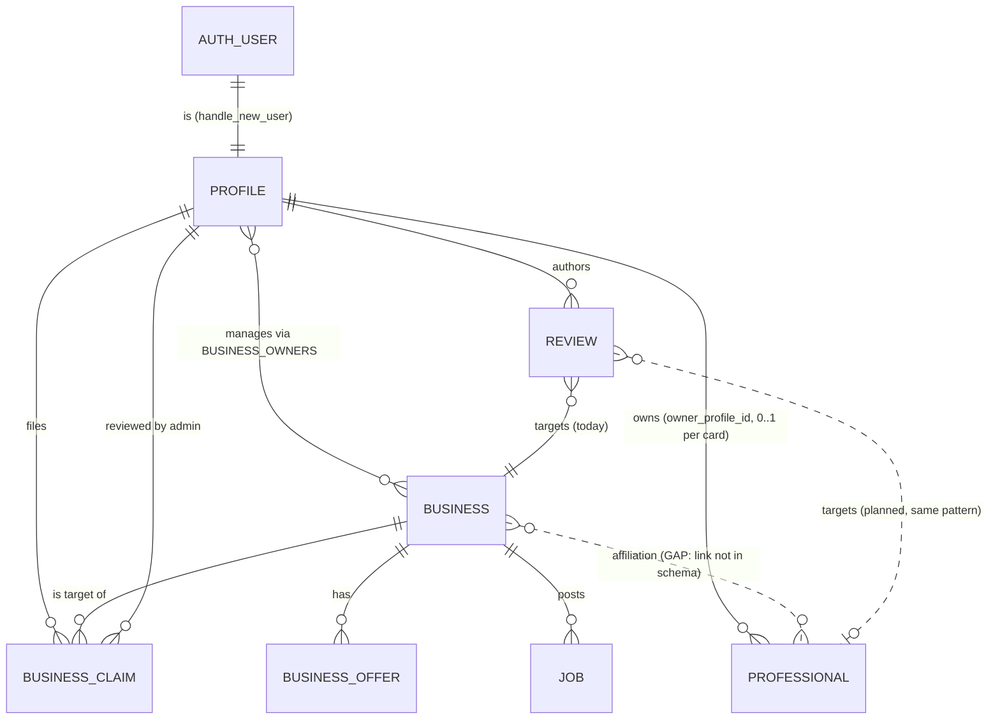
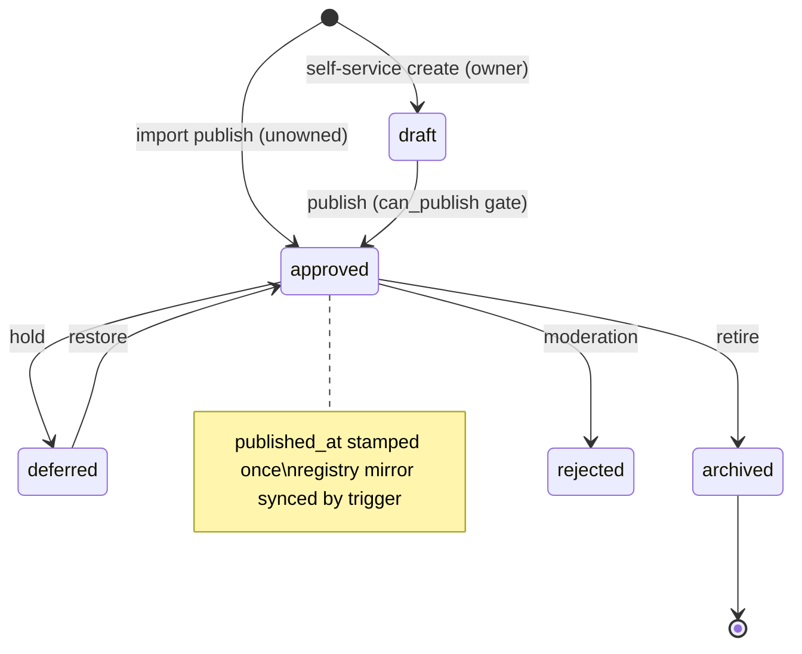
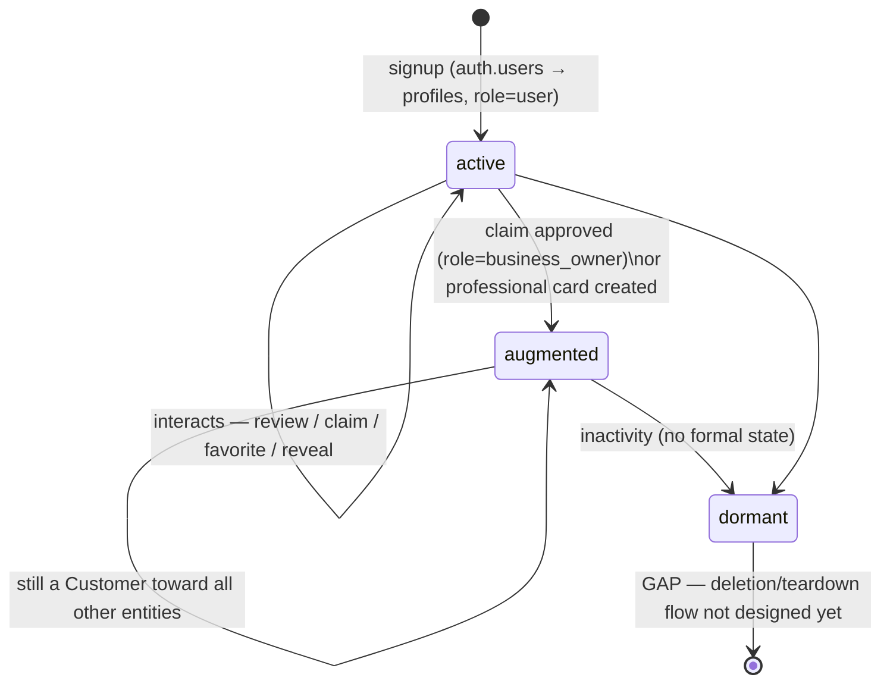

# CORE DOMAIN ARCHITECTURE V1

Canonical model for the three core domain entities — **Business**, **Professional**,
**Customer** — and for the concepts that bind them: relationships, ownership,
reputation, reviews.

**Status:** architecture only. No code, no migrations, no runtime changes.
**Grounding:** every "exists today" claim is verified against the live schema
(2026-07-27); every gap is labeled GAP, not silently designed around.
**Relation to prior docs:** refines and does not contradict `ENTITY_BASE_MODEL.md`,
`OWNERSHIP_SOURCE_CLAIM.md`, `BUSINESS_ENTITY_V1.md`, `PROFESSIONAL_ENTITY_V1.md`,
`REAL_ESTATE_ENTITY_V1.md` (role split) and `PLATFORM_LIFECYCLE_V1.md`. Where those
documents left a question open, this document closes it; the closure is marked
**DECISION**.

---

## 0. The one-sentence model

> A **Business** is an organization the community can visit or hire; a
> **Professional** is a person the community can hire under their own name; a
> **Customer** is a User acting as the demand side — and the same human can be all
> three at once through one account.

The core disambiguation rule (DECISION, inherited from the real-estate role split and
made global):

| If the card is about… | It is a… |
|---|---|
| an organization, venue, brand, team, or licensed company | **Business** |
| one named person selling their own skill/time | **Professional** |
| a person browsing, contacting, buying, reviewing | **Customer** (a User role, not a card) |

An entity is never both Business and Professional. When a sole proprietor "feels like
both", the deciding question is: *would the card survive this person leaving?*
Yes → Business. No → Professional.

---

## 1. Business

**Purpose.** Public card of an organization: discoverable, contactable, reviewable.
The unit the community recommends ("вот эта автомастерская").

**Responsibilities (what Business answers for):**
- Identity of the organization: name, category, description, media.
- Physical/contact presence: address, geo, hours, phone/website/socials.
- Its own offers (`business_offers`) and its own job openings (`jobs.business_id`).
- Being the target of claims, reviews, and business-level reputation.
- Provenance of its own data (`source_url`, `source_kind`).

**Lifecycle** (live enum `content_status`; canonical mapping per ENTITY_BASE_MODEL §3):

`(created via import/admin) → approved (public) ⇄ deferred (hidden) → archived
(merge loser / retired)`; `rejected`, `draft`, `pending` exist in the enum for future
moderated self-service creation (no runtime path sets them today — see
PLATFORM_LIFECYCLE_V1 §3.4). Deletion is admin-only and exceptional
(`admin_delete_business`); archive is the normal end state.

**Ownership.** A Business is *managed*, not *possessed by identity*: zero, one, or
many Users manage it through `business_owners` rows, acquired via the claim flow
(`business_claims` → `admin_review_business_claim`). An unclaimed Business is a normal,
fully public state (most imported cards). Ownership grants editing, never rewriting of
provenance or reviews.

**Belongs to Business:**
- organization-level facts (identity, location, hours, contacts, offers, jobs);
- business-level reputation projection (`rating`, `reviews_count`, external
  `google_rating`/`yelp_rating`);
- claim/ownership records; completeness score; source provenance.

**Must NEVER belong to Business (DECISION):**
- a person's identity — a Business card must not be a disguised person
  (that is a Professional);
- customer data of any kind (favorites, contact-reveal history, review authorship);
- another entity's reputation — no aggregation of professionals' ratings into the
  business rating (and vice versa);
- authentication/roles — a Business is not an account and never logs in;
- platform-wide aggregates (category counts, hub stats — those are Catalog/Metrics
  concerns).

---

## 2. Professional

**Purpose.** Public card of one person offering services under their own name
(репетитор, риелтор, мастер). The unit of *personal* trust.

**Responsibilities:**
- Personal identity of the provider: display name, headline, photo, languages,
  experience.
- Personal service scope: services, service area, availability, credentials.
- Personal contacts (anti-scrape: revealed via `get_professional_contacts`, auth
  required).
- Being the target of professional-level reputation and (future) professional reviews.

**Lifecycle** (live enum `professional_status`):

`draft (self-service, owner-only) → approved (public; published_at stamped once)
⇄ deferred/pending (hold) → archived | rejected`. Two birth paths exist: self-service
creation by the person (`owner_profile_id = creator`, requires `can_publish()`), and
import→review→publish (unowned card). Registry sync (`entities`) mirrors status
automatically.

**Ownership.** `professionals.owner_profile_id` — at most **one** owning User (the
person themself). DECISION: unlike Business, Professional ownership is singular by
definition — a person's card belongs to that person; delegation to assistants is a
future access feature, not co-ownership. **GAP (flagged, not designed):** imported
professionals have no claim flow today ("это я" is not possible); the business claim
machinery is the template when that feature is scheduled.

**Relationship with Business.** A Professional may be *affiliated* with Businesses
(works at, represents) — see §4. Affiliation is a link, never identity: the
Professional card, its reputation and its ownership never merge into the Business.
No affiliation link exists in the schema today (**GAP**); until it exists, the
canonical stance is "unaffiliated by default", and nothing may fake affiliation via
text fields.

**Belongs only to Professional:**
- person-level identity and credentials;
- personal reputation (never inherited from or donated to an affiliated Business);
- personal contact-reveal gating;
- the singular owner link (`owner_profile_id`).

---

## 3. Customer

**DECISION — the central one of this document:** Customer is **not a new table and
not a new card**. Customer is a *role of User*, materialized by the existing
`auth.users` + `public.profiles` pair. Creating a separate Customer entity would
duplicate identity (the exact class of ambiguity this task exists to eliminate).

**Purpose.** The demand side: browses, searches, reveals contacts, favorites,
claims, and reviews. Everything the platform knows about "a customer" is the profile
plus that profile's interaction records.

**Lifecycle:**

`signup (auth.users → handle_new_user trigger → profiles row, role='user')
→ active (interacts) → role-augmented (business_owner / moderator / admin — additive:
an owner is still a customer) → deleted`. **GAP:** account deletion/teardown flow does
not exist (PLATFORM_LIFECYCLE_V1 §13.13); until designed, the lifecycle ends at
"dormant".

**Ownership.** A Customer owns exactly their own profile and their own interaction
records (reviews authored, favorites, claims filed). Nobody else can own a Customer;
a Customer is never listed, never merged, never imported. There is no such thing as
an "unclaimed customer".

**Relationship with User:** identity. One human → one `auth.users` → one `profiles`
row → all roles expressed as `profiles.role` plus relationship rows
(`business_owners`, `professionals.owner_profile_id`). The same account that owns a
business still acts as a Customer toward every *other* business.

**Relationship with Business:** many-to-many interaction, no registration or
membership. Concrete forms today: authored review (`reviews.user_id`, max one per
business per customer — DB-enforced), pending/decided claim, favorite listing,
contact reveal (metrics), report filed.

**Relationship with Professional:** same shape — browse, reveal contacts (auth-gated),
future reviews. No booking/transaction relationship exists in this scope.

---

## 4. Relationships (canonical answers)

| Question | Answer | Canonical form |
|---|---|---|
| Can one Business have many Professionals? | **Yes.** | Future affiliation link Business 1—N..M Professional; today unmodeled (GAP), nothing prevents it conceptually |
| Can one Professional belong to multiple Businesses? | **Yes — affiliated with, never owned by.** A mobile master can work with two salons. | Same affiliation link, M:N. The Professional card stays singular |
| Can a Professional exist without a Business? | **Yes — this is the default and majority case today.** | `professionals` row with no affiliation |
| Can a Customer interact with multiple Businesses? | **Yes, unbounded.** | Interaction rows (reviews/claims/favorites/reveals), one review per Business |
| Can a Customer interact with multiple Professionals? | **Yes, unbounded.** | Same pattern |

Two hard prohibitions (DECISION):
1. **No identity bridges.** A Professional is never "converted" into a Business or
   vice versa by mutating the row; a migration between kinds is a new entity + archive
   of the old one, preserving provenance.
2. **No transitive ownership.** Owning a Business grants nothing over its affiliated
   Professionals' cards, and owning a Professional card grants nothing over any
   Business.

### ERD

`PROFILE` in the customer role is the Customer; no separate box exists by design.

---

## 5. Reputation & Reviews

**Where reviews belong.** A review is a statement **by a Customer about a target
entity**. It is stored once, in the reviews subsystem (`public.reviews`), keyed by
author (`user_id`) and target. Today the only implemented target is Business
(`business_id not null`); Professional reviews are planned and MUST reuse the same
subsystem — verification sessions, moderation statuses, rate limits — not a parallel
one (DECISION). Reviews never live on the entity row.

**Where reputation belongs.** Reputation belongs to the **target entity being
reviewed**, as a *derived projection*: `businesses.rating` / `reviews_count` are
caches refreshed from reviews (`refresh_business_rating` trigger), never manually
written. The same rule applies to `professionals.rating_avg`/`reviews_count` — which
exist as columns but are unwired today (V-11): they stay defined as "projection of
future professional reviews", and nothing else (no imports, no AI, no external
ratings) may write them. External ratings (`google_rating`, `yelp_rating`) are
separate, source-labeled facts — they are provenance data, not platform reputation,
and must never blend into the platform rating.

**Customer reputation (DECISION).** Customers have **no public reputation**. The only
customer-side trust signal is the internal review verification weight
(`verification_level` → `review_level_weight`), which affects how much a review
counts — it is moderation machinery, invisible as a "customer score". Designing a
public customer score is explicitly out of scope and undesired.

**What affects reputation:** platform reviews that are visible (moderation status)
weighted by verification level — nothing else. Merges re-point reviews and recompute
(already implemented). Enrichment, imports, owners, admins cannot write reputation.

**When a review can be created (canonical preconditions):**
1. Author is an authenticated Customer (profile exists).
2. Target is publicly listed (approved/published).
3. Author does not own/manage the target (no self-reviews — canonical rule; enforced
   in the reviews RLS/trigger layer).
4. One review per (customer, target) — DB-unique today for Business.
5. Rate limits and verification flow apply (existing engine).

**Relation triangle:** Customer *authors* → Review *targets* → Business/Professional
*accumulates projection*. Ownership sits outside this triangle: an owner may reply to
reviews (`review_replies`), never author or delete them.

---

## 6. Source of Truth

Exactly one SoT per concept; everything else is a cache, projection, or link.

| Concept | Single Source of Truth | Explicitly NOT the SoT |
|---|---|---|
| Business | `public.businesses` row | queue rows (provenance), `entities` registry (mirror), search results, listings |
| Professional | `public.professionals` row | `entities` registry (sync-trigger mirror), directory dumps, queue rows |
| Customer | `public.profiles` row (identity root: `auth.users`, 1:1 by trigger) | any future "customers" table (must not exist), review author snapshots (`author_display_name` is a display cache) |
| Ownership | the owned entity's single ownership store: `public.business_owners` (Business) and `professionals.owner_profile_id` (Professional) — one rule, one store per entity kind | `profiles.role` (a convenience flag, derived), `business_claims` (process history, not current state) |
| Reviews | `public.reviews` (+ its subsystem tables for verification/replies/reports) | entity rating columns, admin UIs |
| Reputation | **derived from `public.reviews`** — the aggregates on the entity row are refresh-only caches | manual writes, imports, external ratings (separate labeled facts), AI |

Rule for future features (DECISION): a feature may add *links and projections* to
these SoTs, never a second writable copy.

---

## 7. Lifecycle diagrams

### Business

```mermaid
stateDiagram-v2
    [*] --> approved: import publish / admin create
    approved --> deferred: admin hold (hidden)
    deferred --> approved: admin restore
    approved --> archived: merge loser / retire
    state "draft / pending / rejected" as future
    note right of future: enum values reserved for\nfuture self-service creation;\nno runtime path today
    archived --> [*]
```

### Professional

### Customer

---

## 8. Success-criteria check

- **Business vs Professional overlap:** eliminated by the survival rule (§0) and the
  two prohibitions (§4); the only sanctioned connection is a future affiliation link.
- **Customer role:** defined as a User role over `profiles`; no new identity store;
  interactions enumerated.
- **Reputation & Reviews:** one subsystem (`reviews`), one direction (Customer →
  target), reputation strictly a derived projection on the target; customer score
  explicitly ruled out.
- **Future implementation without redesign:** the named GAPs (affiliation link,
  professional claims, professional reviews wiring, account teardown) are additive
  features on top of this model — none of them requires changing the SoT table in §6.

## 9. Open GAPs inherited by future work (listed, not designed)

1. Business↔Professional affiliation link (schema + rules).
2. Professional claim flow ("это я") reusing the claim machinery.
3. Professional reviews wiring into the existing reviews subsystem (unlocks the
   dormant `rating_avg` columns — V-11).
4. Customer account deletion/teardown (identity + owned content policy).
5. Ownership transfer/revocation for Business (PLATFORM_LIFECYCLE_V1 §4.2).
