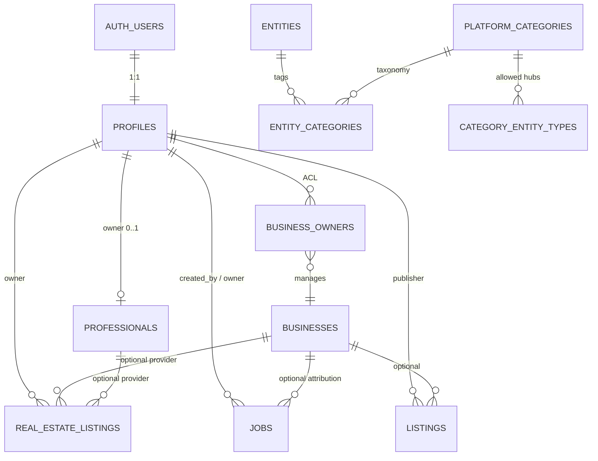

# Architecture Freeze V1

**Status: FROZEN for implementation planning**  
Docs + draft SQL only. **Not applied to production.**

This document is the **single resolution layer** for contradictions across Entity Model, Taxonomy, Review Center, and Review Workflow.  
After approval of “ready for implementation,” changes require a new freeze version (V2).

---

## 1. Canonical documents

| Topic | Canonical | Superseded / secondary |
|-------|-----------|------------------------|
| Account / independence | REPORT §0 + this freeze | — |
| Base fields | [`ENTITY_BASE_MODEL.md`](./ENTITY_BASE_MODEL.md) | — |
| Ownership / Source / Claim | [`OWNERSHIP_SOURCE_CLAIM.md`](./OWNERSHIP_SOURCE_CLAIM.md) | — |
| ACL | [`ENTITY_ACL_V1.md`](./ENTITY_ACL_V1.md) **Variant A** | Variant B deferred |
| Business | [`BUSINESS_ENTITY_V1.md`](./BUSINESS_ENTITY_V1.md) | — |
| Professional | [`PROFESSIONAL_ENTITY_V1.md`](./PROFESSIONAL_ENTITY_V1.md) (freeze section) | [`PROFESSIONAL_PAGE.md`](./PROFESSIONAL_PAGE.md) = UI notes |
| Jobs | [`JOBS_ENTITY_V1.md`](./JOBS_ENTITY_V1.md) + [`JOBS_AND_PUBLISH.md`](./JOBS_AND_PUBLISH.md) | — |
| Real Estate | [`REAL_ESTATE_ENTITY_V1.md`](./REAL_ESTATE_ENTITY_V1.md) | — |
| Marketplace | [`MARKETPLACE_ENTITY_V1.md`](./MARKETPLACE_ENTITY_V1.md) | — |
| Taxonomy structure | [`TAXONOMY_V1.md`](./TAXONOMY_V1.md) + `taxonomy_*_v1.json` | — |
| Taxonomy RU labels | [`taxonomy_ru_v1_final.json`](./taxonomy_ru_v1_final.json) | TAXONOMY_V1 `name_ru` = draft only |
| IA hubs | IA V2 + RU freeze | IA V1 Telegram-only deep-dive |
| Review UI | [`ADMIN_REVIEW_CENTER_V1.md`](./ADMIN_REVIEW_CENTER_V1.md) | Live `/admin/import-review` = transitional |
| Review states | [`REVIEW_WORKFLOW_V1.md`](./REVIEW_WORKFLOW_V1.md) | Legacy enum = aliases |
| Entity type aliases | [`ENTITY_TYPE_MAPPING_V1.md`](./ENTITY_TYPE_MAPPING_V1.md) | — |
| Draft SQL | [`001_additive_schema.sql`](./001_additive_schema.sql) + [`002_seed_platform_categories.sql`](./002_seed_platform_categories.sql) | **Do not apply until implementation task** |
| Gap / readiness | [`IMPLEMENTATION_GAP_ANALYSIS_V1.md`](./IMPLEMENTATION_GAP_ANALYSIS_V1.md) | Snapshot; not product law |

---

## 2. Resolved contradictions

| ID | Conflict | **Freeze decision** |
|----|----------|---------------------|
| C1 | Pro↔Business link required? | **No.** Independent. No `professional_business_links` in v1. |
| C2 | Jobs `created_by_profile_id` NOT NULL vs system import | **NULL allowed** for pure system/import inserts. UI creates still set creator = acting user. |
| C3 | Jobs missing `owner_profile_id` / Source | **Required** on `jobs` (nullable owner; Source immutable). |
| C4 | Pro column `profile_id` vs Base `owner_profile_id` | Canonical name **`owner_profile_id`**. Draft SQL aligned. Unique 0..1 claimed Pro per profile. |
| C5 | Pro status `approved` vs Base `published` | Domain enum may keep `approved` **mapped** to Base `published` for catalog. Prefer Base vocabulary on new tables where cheap. |
| C6 | `private_specialist` vs `professional` | Pipeline legacy → map via [`ENTITY_TYPE_MAPPING_V1.md`](./ENTITY_TYPE_MAPPING_V1.md). Domain entity = **professional**. |
| C7 | Review `approved`/`pending` vs `published`/`needs_review` | **Workflow V1 names are canonical.** Legacy = aliases until migration. |
| C8 | Hub «Барахолка» vs «Купи-продай» | **Купи-продай**. |
| C9 | Home «Услуги» / Lechu / Transfers vs IA hubs | **Target nav:** Бизнесы · Специалисты · Купи-продай · Работа · Недвижимость. Live nav transitional until entities ship. |
| C10 | RE agencies vs inventory | Agency → **Business.real_estate_agencies**; agent → **Professional.real_estate**; unit → **real_estate_listings**. |
| C11 | ACL A vs B | **Variant A** frozen (Business ACL only). |
| C12 | Listing `job` vs `jobs` table | Canonical = **`jobs`**. Do not dual-register listing jobs into `entities`. |
| C13 | Admin publish sets owner? | Import Publish → **`owner_profile_id` stays NULL** until Claim. |

---

## 3. Frozen account + ER

```text
auth.users ──1:1──► profiles
                      │
                      ├── Professional 0..1   (owner_profile_id)
                      ├── Business 0..N       (business_owners ACL)
                      ├── Jobs                (created_by + optional business_id + owner)
                      ├── Marketplace listings
                      └── Real estate listings
```



---

## 4. Entity ↔ Taxonomy (must match)

| Entity (domain) | Taxonomy tree | Hub RU |
|-----------------|---------------|--------|
| `businesses` | `taxonomy_business_v1` | Бизнесы |
| `professionals` | `taxonomy_professional_v1` | Специалисты |
| `listings` (marketplace) | `taxonomy_marketplace_v1` | Купи-продай |
| `jobs` | `taxonomy_jobs_v1` | Работа |
| `real_estate_listings` | `taxonomy_real_estate_v1` | Недвижимость |

Rules:

- No taxonomy tree without a domain entity (Events/Lechu/Transfers = **later**, not MVP freeze).  
- No MVP entity without a category tree (all five have trees).  
- Categories attach via `platform_categories` + `entity_categories` (and legacy map).

---

## 5. Import contract (frozen)

Every imported object MUST resolve:

| Field | Rule |
|-------|------|
| `entity_type` | Mapped to domain via ENTITY_TYPE_MAPPING |
| `category` | Slug from that entity’s taxonomy (or `other`) |
| `moderation_state` / `review_state` | REVIEW_WORKFLOW_V1 (legacy aliases OK until cutover) |

Publish from Review: creates domain row with Source/Import filled; **owner NULL** if unclaimed.

---

## 6. Unified interfaces (architecture)

Shared contracts (implementation later):

1. **ImportNormalizer** → ReviewItem  
2. **ReviewActions** → workflow transitions  
3. **Publisher** → domain insert/update by entity_type  
4. **SearchDocument** → id, entity_type, category, geo, title, status=published  

Same for all sources.

---

## 7. Draft SQL pack

| File | Role |
|------|------|
| `001_additive_schema.sql` | Aligned to this freeze (Base on Pro/Jobs/RE) |
| `002_seed_platform_categories.sql` | Category seed |

**Do not** `db push` / apply until a dedicated implementation task.

---

## 8. Architecture ready for implementation?

See final section in [`ARCHITECTURE_FREEZE_REPORT_V1.md`](./ARCHITECTURE_FREEZE_REPORT_V1.md).
