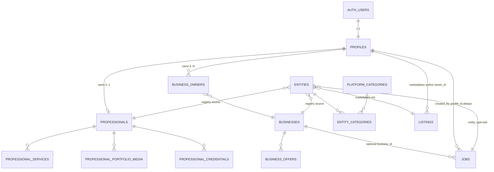

# Entity model v1 — additive migration pack (NOT APPLIED)

**Статус:** черновики обновлены под канон аккаунта (User / Professional / Business независимы).  
**`db push` / production не выполнялись.** Anti-scrape не ослабляется.

## Состав пакета

| Файл | Назначение |
|------|------------|
| [`001_additive_schema.sql`](./001_additive_schema.sql) | enums, `entities`, `professionals` (+ services/portfolio/credentials), stubs, categories, junctions, RLS |
| [`002_seed_platform_categories.sql`](./002_seed_platform_categories.sql) | хабы + leaves + `platform_category_legacy_map` |
| [`category_mapping.json`](./category_mapping.json) | slug mapping |
| [`PROFESSIONAL_PAGE.md`](./PROFESSIONAL_PAGE.md) | краткий канон Professional page |
| [`JOBS_AND_PUBLISH.md`](./JOBS_AND_PUBLISH.md) | Jobs + Publish Eligibility |
| [`OWNERSHIP_SOURCE_CLAIM.md`](./OWNERSHIP_SOURCE_CLAIM.md) | Ownership / Source / Import / Claim (architecture only) |
| [`ENTITY_BASE_MODEL.md`](./ENTITY_BASE_MODEL.md) | Unified Entity Base Model (shared fields / status / visibility) |
| [`BUSINESS_ENTITY_V1.md`](./BUSINESS_ENTITY_V1.md) | Business Entity v1 (Base + domain + derived) |
| [`PROFESSIONAL_ENTITY_V1.md`](./PROFESSIONAL_ENTITY_V1.md) | Professional alignment vs Base / Ownership / Claim |
| [`JOBS_ENTITY_V1.md`](./JOBS_ENTITY_V1.md) | Jobs alignment (personal / business / import) |
| [`MARKETPLACE_ENTITY_V1.md`](./MARKETPLACE_ENTITY_V1.md) | Marketplace listing alignment + import gaps |
| [`ACCESS_MODEL_V1.md`](./ACCESS_MODEL_V1.md) | Platform Access vs Entity Access / Claim |
| [`ENTITY_ACL_V1.md`](./ENTITY_ACL_V1.md) | Decision: Business-only ACL (A) vs universal Entity ACL (B) |
| [`DATABASE_ALIGNMENT_V1.md`](./DATABASE_ALIGNMENT_V1.md) | Production vs Entity Model V1 — gap audit (no SQL) |
| [`PLATFORM_INFORMATION_ARCHITECTURE_V1.md`](./PLATFORM_INFORMATION_ARCHITECTURE_V1.md) | IA from Telegram dataset (hubs / categories) |
| [`PLATFORM_INFORMATION_ARCHITECTURE_V2.md`](./PLATFORM_INFORMATION_ARCHITECTURE_V2.md) | Final IA from all sources (TG+FB+published+queue) |
| [`platform_taxonomy_v2.json`](./platform_taxonomy_v2.json) | Machine-readable taxonomy + source counts |
| [`TAXONOMY_V1.md`](./TAXONOMY_V1.md) | Final per-entity taxonomy (DB/import/search/UI ready) |
| [`taxonomy_business_v1.json`](./taxonomy_business_v1.json) | Business categories |
| [`taxonomy_professional_v1.json`](./taxonomy_professional_v1.json) | Professional categories |
| [`taxonomy_marketplace_v1.json`](./taxonomy_marketplace_v1.json) | Marketplace categories |
| [`taxonomy_jobs_v1.json`](./taxonomy_jobs_v1.json) | Jobs categories |
| [`taxonomy_real_estate_v1.json`](./taxonomy_real_estate_v1.json) | Real Estate categories |
| [`TAXONOMY_RU_V1.md`](./TAXONOMY_RU_V1.md) | Russian display names (US audience) |
| [`taxonomy_ru_v1.json`](./taxonomy_ru_v1.json) | Machine-readable RU labels + surfaces |
| [`TAXONOMY_FREEZE_V1.md`](./TAXONOMY_FREEZE_V1.md) | Validation + freeze candidate (data-backed) |
| [`taxonomy_ru_v1_final.json`](./taxonomy_ru_v1_final.json) | Frozen RU labels (ready_to_freeze) |
| [`ADMIN_REVIEW_CENTER_V1.md`](./ADMIN_REVIEW_CENTER_V1.md) | Admin Review Center architecture (no code) |
| [`REVIEW_WORKFLOW_V1.md`](./REVIEW_WORKFLOW_V1.md) | ReviewItem lifecycle / state machine (no code) |
| [`IMPLEMENTATION_GAP_ANALYSIS_V1.md`](./IMPLEMENTATION_GAP_ANALYSIS_V1.md) | Code vs architecture readiness audit |
| [`ARCHITECTURE_FREEZE_V1.md`](./ARCHITECTURE_FREEZE_V1.md) | Canonical freeze + contradiction resolutions |
| [`ARCHITECTURE_FREEZE_REPORT_V1.md`](./ARCHITECTURE_FREEZE_REPORT_V1.md) | Freeze audit report — ready for implementation? |
| [`ARCHITECTURE_FINAL_AUDIT_V1.md`](./ARCHITECTURE_FINAL_AUDIT_V1.md) | Pre-db-push final architecture audit (breaking-change hunt) |
| [`ENTITY_TYPE_MAPPING_V1.md`](./ENTITY_TYPE_MAPPING_V1.md) | Import/domain entity_type + review status aliases |
| [`REAL_ESTATE_ENTITY_V1.md`](./REAL_ESTATE_ENTITY_V1.md) | Real Estate inventory entity freeze |
| [`ia_stats_snapshot.json`](./ia_stats_snapshot.json) | Reproducible counts for IA v1 (Telegram) |
| [`../scripts/entity-model/backfill_dry_run.py`](../../../scripts/entity-model/backfill_dry_run.py) | dry-run / optional `--apply` |
| [`backfill_dry_run_report.json`](./backfill_dry_run_report.json) | отчёт dry-run |

---

## 0. Canonical account model (product law)

### 0.1 One account

```text
auth.users
    │
    ▼
profiles     ← always exists; center of all user activity
```

Personal profile is not optional and is not replaced by Professional or Business.

### 0.2 Independent managed entities

```text
profiles
    │
    ├── Professional (0..1)     owned via professionals.owner_profile_id (nullable until Claim)
    │
    └── Business (0..N)         owned via business_owners (existing)
```

Rules:

* User does **not** become Professional.
* User does **not** become Business.
* Professional does **not** become Business.
* Business does **not** become Professional.
* All three may coexist for the same account.

### 0.3 No required Professional ↔ Business architecture in v1

Removed from migration draft: `professional_business_links` (and role enum).

Employment / contractor links = **future module**, not part of Entity Model v1 core.

Ownership of both entities is through the **same account** (`profiles` / `auth.uid()`), not through nesting.

### 0.4 Updated ER diagram



There is **no** edge Professional—Business in v1. Job has a single `entity_type=job`; public author is derived from `jobs.business_id`.

### 0.5 Ownership schema

| Entity | Owner key | Public page | Manage |
|--------|-----------|-------------|---------|
| User / profile | `profiles.id = auth.uid()` | `/u/[username]` | account settings |
| Professional | `professionals.profile_id` | `/professional/[slug]` | pro manage (later) |
| Business | `business_owners.user_id` | `/business/[slug]` | business cabinet |

`owns_professional(id)` and existing `owns_business(id)` are separate helpers.

### 0.6 Publishing / attribution context

User always signs in as the personal account. Actions are attributed to different entities:

| Surface | Published as | Author shown |
|---------|--------------|--------------|
| Marketplace personal listing | User (`listings.owner_id` + `publisher_type=profile`) | «Иван Петров» |
| Professional services | Professional (`professional_services.professional_id`) | «Иван Петров — сантехник» |
| Business offers / promos / news | Business (`business_id`) | «Irvine Plumbing LLC» |
| Job with `business_id` set | Business | «Irvine Plumbing LLC» (creator profile **not** public author) |
| Job with `business_id` null | Profile | «Иван Петров» |

### 0.7 One record → many surfaces (no duplicates)

| Record | Appears in |
|--------|------------|
| Job (`jobs`) | Jobs hub, search, filters, feed; **and** Business page **only if** `business_id` set — **same id** |
| `business_offers` | Business page + services catalog (when indexed) — **same id** |
| `professional_services` | Professional page + specialists catalog — **same id** |

Do not copy rows between catalogs.

> Вакансия хранится как одна запись в `jobs`. Страница бизнеса, раздел «Работа», поиск, фильтры и лента являются разными представлениями одной записи.

### 0.8 Confirmation

**User (`profiles`), Professional (`professionals`), and Business (`businesses`) are independent entities managed by one user account.** None is a flag or mode of another. Guest is only an unauthenticated viewing mode, not a fourth entity.

---

## 0.9 Jobs model

`jobs` does **not** exist in production today — only this additive stub. Job may be published by **Business** or by a **publish-eligible Profile**. One `entity_type=job`. No `author_type` / `provider_type` / `owner_type`.

| Column | Nullability | Meaning |
|--------|-------------|---------|
| `created_by_profile_id` | NOT NULL | Actual creator (always) |
| `business_id` | NULL allowed | Public Business context when set |

```text
business_id IS NOT NULL  →  public author = Business
business_id IS NULL      →  public author = Profile (personal hire: nanny, driver, etc.)
```

Business job rules: creator must `owns_business(business_id)`; public author is Business only. Personal job: never shown on a Business page.

Manage: personal → creator; business → any active `business_owners` admin via `owns_business` / `can_manage_job` (not locked to first creator). Soft archive via `status` (`archived` / `expired`).

### 0.10 Access levels + Publish Eligibility

| Level | Can publish user content? |
|-------|---------------------------|
| **Guest** | No (view public only) |
| **Light registration** | No (auth + incomplete eligibility) |
| **Publish-eligible** | Yes, after `can_publish()` |

```text
can_publish =
  authenticated
  AND account_status = 'active'
  AND display_name present
  AND postal_code (ZIP) present
  AND (email_confirmed_at OR phone_confirmed_at on auth.users)
```

`profile_completed` is **computed** (`is_profile_completed`) — not a user-writable flag.

**Applies as base gate to:** Marketplace, Jobs, Professional, Business, Events, Real Estate, Vehicles, other user-published entities. Each adds its own checks (e.g. Job+Business → `owns_business`).

| Product term | Current schema |
|--------------|----------------|
| ZIP | `profiles.postal_code` |
| email verified | `auth.users.email_confirmed_at` (no `profiles.email_verified`) |
| phone verified | `auth.users.phone_confirmed_at` |
| account active / not blocked | **gap** → draft adds `profiles.account_status` (`active`\|`suspended`\|`banned`) |

Helpers in SQL draft: `is_profile_completed`, `has_verified_contact`, `can_publish(uuid)`, `can_publish()`, `can_manage_job`.

See [`JOBS_AND_PUBLISH.md`](./JOBS_AND_PUBLISH.md).

---

## 0.11 Ownership / Source / Import / Claim

Three **independent** facts on every user-facing entity (Business, Professional, Listing, Job, Event, Vehicle, Real Estate):

| Concept | Canonical fields | Mutability |
|---------|------------------|------------|
| **Ownership** | `owner_profile_id` NULL = unclaimed | Changes on Claim |
| **Source** | `source_type`, `source_record_id`, `source_url` | **Immutable** after create |
| **Import** | `imported_at`, `imported_by_profile_id`, `import_batch_id` | Historical; importer ≠ owner |

```text
User create:     owner = profile, source = USER,    import fields NULL
Telegram import: owner = NULL,    source = TELEGRAM, import stamped
Claim:           owner NULL → profile; source unchanged
```

**Never** set `owner_profile_id` (or `business_owners`) to the importing admin.

Lifecycle:

```text
Telegram → Import → Entity (owner NULL) → Claim → owner = Profile
                     source stays TELEGRAM forever
```

Naming collision: `entities.source_id` = registry FK to domain row — **not** external provenance.

Gaps vs production (documented, not migrated): `listings.owner_id` NOT NULL; Business `owner_id` / `created_by` / `business_claims`; Professional `profile_id` as owner; Jobs `created_by` ≠ owner. Full detail: [`OWNERSHIP_SOURCE_CLAIM.md`](./OWNERSHIP_SOURCE_CLAIM.md).

**This section is architecture-only** — no SQL / Claim UI in this pack step.

---

## 0.12 Unified Entity Base Model

Shared foundation for Business, Professional, Listing, Job, Event, Vehicle, Real Estate — **not** a redesign of each domain.

```text
Entity → Ownership | Creator | Source | Import | Status | Visibility | Timestamps
```

Canonical shared concepts: `id`, nullable `owner_profile_id`, `created_by_profile_id`, immutable `source_*`, optional import fields, unified `status` + `visibility`, `created_at` / `updated_at` (+ optional lifecycle timestamps). Domain fields stay specialized.

Status target vocabulary: `draft | pending | published | hidden | archived | rejected | expired | deleted` (map legacy `approved`/`active` later).  
Visibility target: `public | unlisted | private` (listings today lack `private`).

Contradictions with earlier docs / production are **listed, not fixed** in [`ENTITY_BASE_MODEL.md`](./ENTITY_BASE_MODEL.md).

---

## 0.13 Business Entity v1

Business = Base Entity + domain profile fields + `business_owners` / `business_claims`.  
Supports import with `owner = NULL`, Claim, multi-admin. Contacts stay protected (anti-scrape).  
Ratings / review counts = derived caches; offer/job counts = query-time.  

Full field split (Base / Business / Derived) and production gaps: [`BUSINESS_ENTITY_V1.md`](./BUSINESS_ENTITY_V1.md).

---

## 0.14 Professional / Jobs / Marketplace alignment

Architecture-only check against Base + Ownership + Claim + Publish + Business:

| Entity | Doc | Verdict |
|--------|-----|---------|
| Professional | [`PROFESSIONAL_ENTITY_V1.md`](./PROFESSIONAL_ENTITY_V1.md) | Domain OK; owner=`profile_id`; missing Source/Import/Creator/visibility; Claim/import need nullable owner |
| Jobs | [`JOBS_ENTITY_V1.md`](./JOBS_ENTITY_V1.md) | Attribution via `business_id` OK; missing `owner_profile_id`/Source/Import/visibility; creator NOT NULL vs import |
| Marketplace | [`MARKETPLACE_ENTITY_V1.md`](./MARKETPLACE_ENTITY_V1.md) | Has status/visibility; `owner_id` NOT NULL + no Source blocks unclaimed import/Claim |

**One Base Model:** usable as the shared checklist **without product exceptions**; physical schemas still use old names and omit columns — migrations required later, not now.

---

## 0.15 Access Model V1

Two layers:

* **Platform Access** — Admin / Moderator (Support deferred): system-wide staff powers; **never** Owner of Business by role alone; never auto-inserted into `business_owners`.
* **Entity Access** — per-entity Owner via `owner_profile_id` (+ Business ACL `business_owners`). Manager = optional later for Business only.

Claim: sets `owner_profile_id`; grants Entity Owner to claimant for Business; Source/Creator/Import and Platform roles unchanged; Platform Admins keep override access.

Full detail: [`ACCESS_MODEL_V1.md`](./ACCESS_MODEL_V1.md).

---

## 0.16 Entity ACL V1 (decision)

**Variant A (chosen):** `business_owners` only for Business; all other entities → `owner_profile_id` alone.  
**Variant B (deferred):** universal Entity ACL (`entity_type` + `entity_id` + `profile_id` + `role`) when teams/agencies need multi-member roles across many entity types.

Why A now: matches Access Model V1, Claim/Owner model, existing production, and avoids empty universal ACL. B remains the upgrade path for Enterprise-scale co-management — not V1 scope.

See [`ENTITY_ACL_V1.md`](./ENTITY_ACL_V1.md).

---

## 0.17 Database Alignment V1 (audit)

Production vs approved architecture — **inventory only**, no SQL in this step.

* Closest: Marketplace status/visibility; Business domain + `business_owners` / `business_claims`.  
* Largest gaps: no `professionals` / `jobs`; missing Base Ownership/Source/Import on Business & listings; listings `owner_id` NOT NULL; no `can_publish`; status label drift; job-as-listing.

Phased change map (1 additive → 2 behavior → 3 rename/migrate): [`DATABASE_ALIGNMENT_V1.md`](./DATABASE_ALIGNMENT_V1.md).

---

## 0.18 Platform Information Architecture V1

From **8 866** Telegram logical posts (Fun for Mom + LA_OrangeCounty, all decisions):

Top commercial hubs by volume: **Professional → Business → Marketplace → Jobs → Real Estate**; large **Community seeking** intent; Events smaller.  
No Lost & Found / Transfers as top hubs. Subcategories only where data supports (esp. Real Estate apt/room; selective Beauty/Education).

Full nav + MVP recommendations: [`PLATFORM_INFORMATION_ARCHITECTURE_V1.md`](./PLATFORM_INFORMATION_ARCHITECTURE_V1.md).

---

## 0.19 Platform Information Architecture V2

All-sources IA refreshed for approval:

| Source | Size |
|--------|-----:|
| Telegram reviewer_v1 | 8 866 |
| Facebook curated seed | 52 |
| Published Business (live) | 315 |
| Published Professional | 0 |
| import_review_items | 5 585 |
| Listings (live total / hub MP+services) | 43 / 14+28 |

**MVP hubs:** Бизнесы · Специалисты · Купи-продай · Работа · Недвижимость.  
**Home nav today** (Бизнесы · Marketplace · Услуги · Лечу · Переводы) **misaligned** with data.  
Categories locked to TAXONOMY_V1 + RU freeze. Jobs = TG-only pipeline gap (783 → 0 in queue).

**Freeze validation (§13):** **READY_FOR_FREEZE** — no blocking taxonomy issues for Review Center; remaining issues are classifier/import/`other` cleanup (non-blocking).

See [`PLATFORM_INFORMATION_ARCHITECTURE_V2.md`](./PLATFORM_INFORMATION_ARCHITECTURE_V2.md) + [`platform_taxonomy_v2.json`](./platform_taxonomy_v2.json) (`validation_freeze_v1`).

---

## 0.20 Platform Taxonomy V1

Final category trees per entity (Business / Professional / Marketplace / Jobs / Real Estate), with counts, intersections, filters-vs-categories, coverage and scale notes.

JSON: `taxonomy_*_v1.json`. Doc: [`TAXONOMY_V1.md`](./TAXONOMY_V1.md).

---

## 0.21 Platform Taxonomy RU V1

Russian **display names** for taxonomy slugs (US Russian-speaking audience). Slugs and tree unchanged.

Hubs: Бизнесы · Специалисты · Купи-продай · Работа · Недвижимость.

JSON: [`taxonomy_ru_v1.json`](./taxonomy_ru_v1.json). Doc: [`TAXONOMY_RU_V1.md`](./TAXONOMY_RU_V1.md).

---

## 0.22 Taxonomy Validation & Freeze V1

Data-backed validation of RU labels (Telegram ≈8 426 posts, Facebook seed, published platform categories, import_review). Display renames vs early RU_V1 include pets/travel/vehicles + hub **Купи-продай** (Барахолка rejected). Slugs/structure unchanged.

Status: **`ready_to_freeze`** — after product approval, changes only via TAXONOMY_RU_V2+.

Doc: [`TAXONOMY_FREEZE_V1.md`](./TAXONOMY_FREEZE_V1.md). JSON: [`taxonomy_ru_v1_final.json`](./taxonomy_ru_v1_final.json).

---

## 0.23 IA V2 Final Validation → Freeze

Full category %, provenance, misclassification audit, classifier quality, per-category Stable/Needs Review/Merge.

**Decision: Taxonomy Ready for Freeze.**  
No blocking issues before Admin Review Center. Post-launch: shrink `other`, Jobs queue path, RE/MP leaf tagging.

After approval: no Taxonomy edits without a new architecture decision.

Details: [`PLATFORM_INFORMATION_ARCHITECTURE_V2.md`](./PLATFORM_INFORMATION_ARCHITECTURE_V2.md) §13 · `platform_taxonomy_v2.json` → `validation_freeze_v1`.

---

## 0.24 Admin Review Center V1 (Architecture)

Unified moderation UI for Telegram, Facebook, and future importers. Source-agnostic queue + workspace; quick/bulk actions; field provenance; taxonomy-bound category picker.

**No code / SQL / migrations in this pack.**

See [`ADMIN_REVIEW_CENTER_V1.md`](./ADMIN_REVIEW_CENTER_V1.md).

---

## 0.25 Review Workflow V1

ReviewItem lifecycle: states (`imported` → … → `published` / `rejected` / `merged` / `archived`), state machine, moderator actions per state, audit events. Source-agnostic (TG / FB / Google / Yelp).

See [`REVIEW_WORKFLOW_V1.md`](./REVIEW_WORKFLOW_V1.md).

---

## 0.26 Implementation Gap Analysis V1

Code vs architecture audit (20 modules). Strong: Business, Marketplace, RLS. Gaps: Entity Model apply, Professional/Jobs/RE, Taxonomy-in-app, Review Center V1.

Critical path: schema → taxonomy bind → Jobs import → Review Center → public 5 hubs.

See [`IMPLEMENTATION_GAP_ANALYSIS_V1.md`](./IMPLEMENTATION_GAP_ANALYSIS_V1.md).

---

## 0.27 Architecture Freeze V1

Contradiction audit resolved. Entity Model + Professional + Jobs + Real Estate + Taxonomy + entity-type mapping **frozen** for implementation. Draft SQL aligned (`001_additive_schema.sql`) — **not applied**.

**Архитектура готова к реализации? Да** (next = apply migrations in a dedicated task).

Canonical: [`ARCHITECTURE_FREEZE_V1.md`](./ARCHITECTURE_FREEZE_V1.md) · Report: [`ARCHITECTURE_FREEZE_REPORT_V1.md`](./ARCHITECTURE_FREEZE_REPORT_V1.md).

---

## 0.28 Architecture Final Audit V1 (pre–db push)

Независимый hunt на будущие breaking changes перед первым apply.

**Готова к первому применению миграций? Да** — с условиями: draft `001` (CASCADE→SET NULL уже в draft), **не** apply `002` as-is до rewrite hubs под TAXONOMY freeze, aliases `marketplace_item` / status vocab приняты.

Полный отчёт: [`ARCHITECTURE_FINAL_AUDIT_V1.md`](./ARCHITECTURE_FINAL_AUDIT_V1.md).

---

## 1. SQL-черновик additive-миграции

Схема **additive**: старые `categories`, `listing_categories`, `businesses.category_id`, listing detail FKs **не удаляются**.

Создаётся:

- `entity_type`, `offer_kind`, статусы;
- `entities` (registry) — **без контактов**;
- `professionals` — независимая страница `/professional/[slug]`, владение через `profile_id` (0..1);
- `professional_services`, `professional_portfolio_media`, `professional_credentials`;
- **нет** `professional_business_links` в v1;
- view `professionals_public` + `owns_professional()` RLS;
- stubs: `vehicles`, `real_estate_listings`, `events`; **`jobs`** with `created_by_profile_id` NOT NULL + optional `business_id` + RLS/`can_manage_job`;
- `can_publish` / `is_profile_completed` / `has_verified_contact` + additive `profiles.account_status`;
- `platform_categories` + `category_entity_types` + `entity_categories` + `category_cross_links` + `entity_offer_kinds` + legacy map;
- sync triggers → `entities` (jobs → `entity_type=job`; listings no longer dual-register `listing_type=job`).

**UI:** отдельный `ProfessionalProfileView`, не fork `BusinessProfileView`.

**listings.service:** не авто-Professional.
---

## 2. Mapping старых категорий

См. `category_mapping.json`.

- **15/15** business categories → leaves под `hub-businesses` (slug без изменений).
- **30/30** listing categories mapped:
  - marketplace: slug as-is под `hub-marketplace`;
  - services: **`svc-` prefix** (`beauty`→`svc-beauty`, `legal`→`svc-legal`) из‑за коллизий;
  - transfers/lechu: slug as-is под своими хабами.
- Хабы-заготовки: jobs / vehicles / real-estate / events (пока без leaves).

`wanted` → `offer_kind=seek` (не категория).

---

## 3. Backfill dry-run

```bash
python3 scripts/entity-model/backfill_dry_run.py \
  --report-json docs/architecture/entity-model-v1/backfill_dry_run_report.json
```

`--apply` отказано, пока нет таблиц `entities` / `platform_categories`.

---

## 4. Отчёт unmapped (live dry-run)

| Метрика | Значение |
|---------|----------|
| Legacy business categories | 15 / 15 mapped |
| Legacy listing categories | 30 / 30 mapped |
| Approved businesses | 307 |
| With mapped primary category | **276** |
| Businesses with **null** category | **31** (нужен ручной/admin assign → leaf или `services`) |
| Active marketplace | 13 / 13 mapped primary |
| offer_kind histogram (marketplace) | sell=12, seek=1 |
| Active service listings | 18 (не backfill в Professional на этапе 1) |

Список 31 бизнеса без категории — в `backfill_dry_run_report.json` → `entity_backfill.business.unmapped_or_null_category`.

---

## 5. RLS (кратко)

| Объект | anon | authenticated |
|--------|------|---------------|
| `businesses` | **нет SELECT** (как сейчас) | owners/admins |
| `businesses_public` | SELECT flags | SELECT |
| `professionals` | **нет SELECT** | owner/admin |
| `professionals_public` | SELECT без контактов/private address | SELECT |
| `professionals` INSERT | — | `can_publish()` + `profile_id = auth.uid()` |
| `entities` base | нет | published (+ admin) |
| `entities_public` | SELECT published ids | SELECT |
| `platform_categories` / junctions / offer_kinds / cross_links | SELECT active/public | SELECT |
| `entity_categories` | SELECT если entity published | SELECT |
| `jobs` SELECT | `status = published` | published **or** `can_manage_job` |
| `jobs` INSERT | нет | `can_publish()` + `created_by_profile_id = auth.uid()` + (`business_id` null **or** `owns_business`) |
| `jobs` UPDATE/DELETE | нет | `can_manage_job` (personal creator **or** any business admin) |
| vehicles/RE/events stubs | нет публичного | owner/admin |

Contacts API бизнесов **не меняется** в этом пакете. Professional contacts API — отдельный follow-up по тому же паттерну (не в этой миграции).

---

## 6. Индексы

- `entities (entity_type, source_id)` UNIQUE; `(status, entity_type)`; `(source_id)`
- `platform_categories (parent_id, sort_order)`; `(status, sort_order)`
- `category_entity_types (entity_type)`
- `entity_categories` unique partial one primary; `(category_id, role)`
- `professionals (status)`, `(profile_id)`, `(city_geoid)`

---

## 7. Database constraints / triggers

- depth ≤ 2 на `platform_categories`;
- `entity_categories`: allowed type via `category_entity_types`; max 3 secondary; cross-hub only via `category_cross_links`;
- one primary unique index;
- `entity_offer_kinds` seed pairs;
- delete domain row → delete registry → cascade `entity_categories` (no orphans);
- vehicles/RE offer_kind CHECKs.

---

## 8. TypeScript — план изменений (ещё не кодить в prod)

Новые файлы (после approve):

- `types/entity.ts` — `EntityType`, `OfferKind`, `PlatformCategory`, `EntityCategoryRole`
- `types/professional.ts` — `Professional` list/detail (list без контактов)
- расширить `types/database.ts` после apply

Dual-read:

- `lib/entities/registry.ts` — upsert helpers (server-only)
- `lib/entities/categories.ts` — resolve primary/secondary
- feature flag `ENTITY_MODEL_V1=1` для search/admin

**Не трогать** `mapBusinessList` / contacts strip.

---

## 9. План search API

1. **Flag off (default):** текущий `/api/search/businesses` + AI без изменений.
2. **Flag on (shadow):** параллельный query `entities_public` ⨝ `entity_categories` ⨝ `platform_categories`; hydrate domain rows через service role + list mappers.
3. Facets: `Все | Business | Professional` по `entity_type`.
4. Marketplace/Lechu/Transfer остаются на catalog views до phase 2 registry hydrate.
5. Public payload: title/description/categories/city/service_area/centroid/**contact flags only**.

---

## 10. Anti-scrape проверки (обязательные)

- [x] anon SELECT `businesses` → deny (dry-run OK)
- [x] `businesses_public` без phone/email/website/instagram (dry-run OK)
- [ ] после apply: `entities` / `entities_public` не содержат contact columns
- [ ] `professionals_public` не содержит phone/email/website/instagram/private_address_line
- [ ] search JSON без plaintext контактов
- [ ] browser не получает service role / full business select
- [ ] contacts API бизнесов без изменений контракта
- [ ] rate limits сохранены

---

## 11. Rollback

1. Feature flag off → старый search/admin.
2. `DROP VIEW` public helpers; `DROP TABLE` entity_* / platform_categories / professionals / stubs **только если** ещё нет prod данных в professionals/vehicles.
3. Triggers drop → legacy tables нетронуты.
4. Legacy `categories` / `listing_categories` / FKs остаются источником истины.

Порядок rollback SQL (черновик): reverse of 001 (views → triggers → tables → types) — оформить отдельным `900_rollback.sql` при approve.

---

## 12. Feature flags — поэтапное включение

| Этап | Flag | Действие |
|------|------|----------|
| 0 | — | Apply 001+002 на staging only |
| 1 | `ENTITY_REGISTRY_BACKFILL=1` | backfill `--apply` businesses + marketplace |
| 2 | `ENTITY_CATEGORIES_READ=1` | admin dual-read categories |
| 3 | `ENTITY_SEARCH_SHADOW=1` | shadow compare search results |
| 4 | `ENTITY_SEARCH_PRIMARY=1` | cutover search facets |
| 5 | `PROFESSIONALS_IMPORT=1` | import specialist → Professional (+ service offer), **не** Business |
| 6 | later | Vehicle/RE inventory extract from offers; public catalogs |

URL `/business/:slug`, `/marketplace/:id` не менять на всех этапах.

---

## Правила импорта Professional (для следующего PR после схемы)

```
Professional
+ primary category (hub-services leaf or hub-businesses leaf)
+ ≤3 secondary
+ optional service listing/offer linked by provider_professional_id (future)
+ service_area_text / radius
+ contacts only on professionals table + reveal API
≠ Business  (unless source explicitly is company/salon/clinic/store)
```

---

## Vehicle / RealEstate

| Сценарий | Куда |
|----------|------|
| «Дилер продаёт авто» / «Агентство сдаёт жильё» (общее) | `business_offers` service/product-like |
| Конкретный Toyota Sienna / квартира с beds/price | `vehicles` / `real_estate_listings` + registry entity_type + provider_* FK |

---

## Обязательные тесты (чеклист перед prod apply)

1. Одна primary на entity — unique index.
2. 4-я secondary → exception.
3. Wrong entity_type on category → exception.
4. Cross-hub secondary без allow-list → exception.
5. Delete business → entity + entity_categories gone.
6. Public search / views — no contacts.
7. anon — no base professionals/businesses.
8. Professional private_address not in public view.
9. Old business/marketplace URLs still work (legacy FKs intact).
10. Search works with flag off.
11. Job personal: `business_id` null + `created_by_profile_id` set; not on any Business page.
12. Job business: requires `owns_business`; public author Business; creator not shown as author.
13. Job INSERT rejects foreign `created_by_profile_id` / Guest / Light registration (`can_publish` false).
14. Job UPDATE: other business admin can manage; `created_by_profile_id` immutable.
15. One job id in Business + Jobs hub + search (no copies).
16. `can_publish` false without ZIP / display_name / verified contact / non-active status.

---

## Что сознательно не сделано

- apply / `db push`
- удаление старых таблиц/полей
- изменение главной
- AI-переклассификация
- изменение публичных URL
- ослабление anti-scrape
- массовый перевод 18 service listings → Professional
- назначение категории 31 бизнесам без `category_id`
- полный UI `/professional/[slug]` / Jobs / create forms
- wiring `can_publish` into **existing** Marketplace `listings` RLS (document only; follow-up)
- отклики / ATS / Professional↔Business links
- Claim UI / moderation / SQL for Ownership+Source columns (architecture in OWNERSHIP_SOURCE_CLAIM.md only)

---

## Professional Public Page Architecture

> **Professional** is a first-class public page owned by the user account.  
> Not a User profile mode, not a Business flag, not a service listing, not `BusinessProfileView` with hidden blocks.  
> **No required link to Business in v1.**

### Three public pages

```text
/u/[username]           — personal User page (profiles)
/professional/[slug]    — Professional
/business/[slug]        — Business
```

Guest = unauthenticated viewing mode (gated contacts/actions), not a fourth entity.

### 1. Data model

| Table | Role |
|-------|------|
| `professionals` | Core: slug, name, headline, photo, bio, experience, languages, hours, ratings, public geo, service_area; contacts + private_address protected |
| `entities` | Registry `entity_type=professional` |
| `entity_categories` | 1 primary + ≤3 secondary |
| `professional_services` | Services/prices on the page; also catalogued by same id |
| `professional_portfolio_media` | Portfolio |
| `professional_credentials` | Certificates / licenses |

**Not in v1:** `professional_business_links`.

### 2. Ownership (not nesting)

```text
auth.users ── profiles
                 │
                 ├── owns Professional (0..1) via profile_id
                 └── owns Business (0..N) via business_owners
```

Same account may have all three pages. Creating a Business never creates a Professional and vice versa. They are siblings under `profiles`, not parent/child.

Example:

```text
/u/ivan
/professional/ivan-plumber
/business/irvine-plumbing-llc
```

### 3. Route & loaders

| Item | Plan |
|------|------|
| URL | `/professional/[slug]` |
| Public loader | `professionals_public` + services/portfolio/credentials + categories — **no** contact plaintext |
| Contacts | future `GET /api/professional/[slug]/contacts` (auth + rate limit) |
| Manage | later `/professional/[slug]/manage` or account section |

Forbidden: `BusinessProfileView` conditionals.

### 4. Public vs protected fields

**Public:** identity, headline, media, bio, experience, languages, hours, ratings, city/centroid, service area, categories, services (incl. «по запросу»), portfolio, credentials, contact **flags**.

**Protected:** phone, email, website, instagram_url, private_address_line.

### 5. Owner rights

| Action | Who |
|--------|-----|
| Create / edit / delete Professional + children | `owns_professional` (= profile owner) or admin |
| Publish to approved | moderation RPC (recommended) |
| Edit Business | `owns_business` — separate |
| Reveal others' contacts | authenticated via contacts API |

### 6. Reusable UI pieces only

Shared: reviews, rating, gallery, category chips, service area, contact reveal chips.  
**Not shared:** Business page shell, branches, legal name, business offers catalog, company claim flow.

Dedicated later: `ProfessionalProfileView`, services/portfolio/credentials components.

### 7. Diff vs Business

| | Professional | Business |
|--|--------------|----------|
| URL | `/professional/[slug]` | `/business/[slug]` |
| Count per account | 0..1 | 0..N |
| Identity | person / specialist | brand / org |
| Branches | no | yes |
| Catalog | `professional_services` | `business_offers` |
| Attribution of posts | Professional | Business |
| Link to the other | none in v1 | none in v1 |

### 8. UI phases (after schema)

1. Apply schema  
2. Types + loaders (strip contacts)  
3. Read-only `/professional/[slug]`  
4. Contacts API  
5. Owner edit  
6. Search facet «Профи»  
7. Import → Professional only (not auto-Business)  
8. Messaging / reviews  

---

## Следующий шаг (нужно подтверждение)

1. Pre-push checklist из [`ARCHITECTURE_FINAL_AUDIT_V1.md`](./ARCHITECTURE_FINAL_AUDIT_V1.md) (rewrite `002` hubs; apply `001` first).  
2. Approve SQL → перенести в `supabase/migrations/` или явный staging apply.  
3. Dry-run → `--apply` backfill businesses + marketplace.  
4. Assign 31 null-category businesses.  
5. PR: Professional import + read-only page + contacts API.

**Стоп.** Миграции не применять до отдельного подтверждения.
