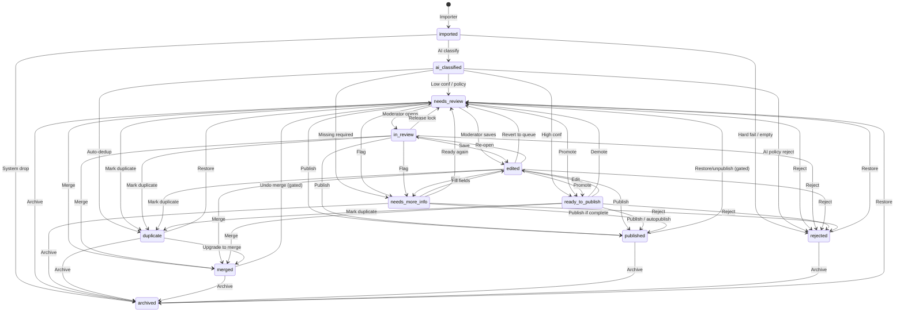

# Review Workflow V1

**Architecture only.** No code. No SQL. No migrations. No production changes.

Defines the full lifecycle of a **ReviewItem** for every importer (Telegram, Facebook, Google Business, Yelp, future).

Companion UI: [`ADMIN_REVIEW_CENTER_V1.md`](./ADMIN_REVIEW_CENTER_V1.md).  
Taxonomy: TAXONOMY_V1 / IA V2 freeze.

---

## 0. Principles

1. **One state machine** for all sources — importers only create `imported` items.  
2. **Status is canonical**; UI badges and filters bind to these states.  
3. **Flags** (optional) refine without exploding states: `has_unpublished_edits`, `enrichment_failed`, `locked_by`.  
4. **Published / Rejected / Merged / Archived** are terminal or semi-terminal (see Restore).  
5. Legacy `import_review_items.review_status` maps into this model (appendix).

Actors:

| Actor | Role |
|-------|------|
| **Importer** | Writes raw ReviewItem |
| **AI pipeline** | Classify, enrich, auto-route |
| **System** | Dedup, expiry, archive jobs |
| **Moderator / Admin** | Human decisions in Review Center |
| **Platform** | Publish side-effects (create domain entity) |

---

## 1. States

| State | Purpose | Who can enter | Allowed next states |
|-------|---------|---------------|---------------------|
| **imported** | Raw item landed; no AI yet | Importer | `ai_classified`, `rejected` (hard fail), `archived` |
| **ai_classified** | Entity/category/confidence set; enrichment may follow | AI pipeline | `needs_review`, `ready_to_publish`, `duplicate`, `rejected` (policy), `needs_more_info` |
| **needs_review** | Default human queue | AI (low conf / policy) · System (dedup reopen) · Moderator (Restore) | `in_review`, `edited`, `ready_to_publish`, `published`, `rejected`, `duplicate`, `merged`, `needs_more_info`, `archived` |
| **in_review** | Soft lock — moderator working | Moderator (open workspace) | `needs_review`, `edited`, `published`, `rejected`, `duplicate`, `merged`, `needs_more_info` |
| **edited** | Human saved field changes; not published yet | Moderator (Edit / Change entity / category) | `needs_review`, `in_review`, `published`, `rejected`, `duplicate`, `merged`, `ready_to_publish`, `needs_more_info` |
| **ready_to_publish** | High confidence / policy — waiting publish (auto or human) | AI · Moderator | `published`, `needs_review`, `edited`, `rejected`, `duplicate`, `merged` |
| **duplicate** | Marked as dupe of another item/entity; not primary | AI · System · Moderator | `needs_review` (Restore), `merged`, `archived` |
| **merged** | Content absorbed into target; satellite closed | Moderator · System (after Merge) | `archived` · `needs_review` (Restore — rare, undo merge) |
| **published** | Domain entity created/updated; queue item closed as success | Moderator · System (autopublish) | `archived` · `needs_review` (Restore / unpublish flow — gated) |
| **rejected** | Explicit reject with reason | Moderator · AI (policy spam) | `needs_review` (Restore), `archived` |
| **needs_more_info** | Blocked on missing contact/geo/media | AI · Moderator | `needs_review`, `edited`, `published`, `rejected`, `archived` |
| **archived** | Soft-deleted from active queues; retained for audit | Moderator · System | `needs_review` (Restore only) |

### Notes on states

- **Split** is an **action**, not a state: creates 1..N new ReviewItems (`imported` or `needs_review`) and may leave parent `archived` or `rejected` with reason `split`.  
- **edited** is visible in filters so moderators can resume drafts; it remains publishable.  
- **duplicate** vs **merged**: duplicate = “don’t publish, points elsewhere”; merged = “fields already combined into target”.  
- Autopublish path: `ai_classified` → `ready_to_publish` → `published` (no human).

---

## 2. State machine

### 2.1 Diagram



### 2.2 Transition classes

| Class | Examples |
|-------|----------|
| **Automatic (System/AI)** | `imported`→`ai_classified`; auto-dedup→`duplicate`; high conf→`ready_to_publish`; autopublish→`published`; enrichment attach (flag, not always state change) |
| **AI actions** | Classify entity/category; set confidence/reason; suggest reject; suggest needs_more_info |
| **Moderator actions** | Publish, Reject, Merge, Split, Edit, Change entity/category, Restore, Archive, Mark duplicate |
| **Irreversible (practically)** | Publish side-effect (entity exists — undo needs gated unpublish); Merge absorb (undo gated); Reject with legal/prohibited reason (restore restricted); Archive after retention policy |

“Irreversible” means **not one-click undo** — Restore exists but is audited and permission-gated.

### 2.3 Happy paths

```text
Importer → imported → AI → ai_classified → needs_review
  → Moderator Edit → edited → Publish → published

Importer → imported → AI → ai_classified → ready_to_publish
  → autopublish → published

Importer → imported → AI → duplicate → (satellite stays)
Primary → published
```

---

## 3. Actions by state

| Action | imported | ai_classified | needs_review | in_review | edited | ready_to_publish | needs_more_info | duplicate | merged | published | rejected | archived |
|--------|:--------:|:-------------:|:------------:|:---------:|:------:|:----------------:|:---------------:|:---------:|:------:|:---------:|:--------:|:--------:|
| **Publish** | — | — | ✓ | ✓ | ✓ | ✓ | ✓* | — | — | — | — | — |
| **Reject** | — | ✓† | ✓ | ✓ | ✓ | ✓ | ✓ | — | — | — | — | — |
| **Merge** | — | — | ✓ | ✓ | ✓ | ✓ | — | ✓‡ | — | — | — | — |
| **Split** | — | — | ✓ | ✓ | ✓ | — | ✓ | — | — | — | — | — |
| **Edit** | — | — | ✓ | ✓ | ✓ | ✓ | ✓ | — | — | —§ | — | — |
| **Change Entity Type** | — | — | ✓ | ✓ | ✓ | ✓ | ✓ | — | — | — | — | — |
| **Change Category** | — | — | ✓ | ✓ | ✓ | ✓ | ✓ | — | — | — | — | — |
| **Mark Duplicate** | — | — | ✓ | ✓ | ✓ | ✓ | — | — | — | — | — | — |
| **Restore** | — | — | — | — | — | — | — | ✓ | ✓‖ | ✓‖ | ✓ | ✓ |
| **Archive** | ✓ | ✓ | ✓ | — | ✓ | ✓ | ✓ | ✓ | ✓ | ✓ | ✓ | — |
| **Release lock** | — | — | — | ✓→needs_review | — | — | — | — | — | — | — | — |

\* Publish from `needs_more_info` only if required fields now satisfied.  
† AI policy reject only; human may also reject after reopening.  
‡ Duplicate → Merge when absorbing into target.  
§ Published: edit happens on **domain entity**, not ReviewItem (or gated reopen).  
‖ Gated: undo merge / unpublish + return to `needs_review`.

### Action semantics (short)

| Action | Effect |
|--------|--------|
| **Publish** | Persist fields → create/update domain entity → `published` + `published_ref` |
| **Reject** | Require `reject_reason` → `rejected` |
| **Merge** | Choose target ReviewItem or published entity → copy/merge fields → source `merged` |
| **Split** | Create child ReviewItems; parent `archived` (reason `split`) or kept with link |
| **Edit** | Save fields → `edited` (or stay `in_review`); provenance `moderator` |
| **Change Entity Type** | Set entity_type; clear incompatible category → usually `edited` |
| **Change Category** | Set category/subcategory within taxonomy → `edited` |
| **Mark Duplicate** | Set `duplicate_of_*` → `duplicate` |
| **Restore** | Return to `needs_review`; clear terminal markers as policy allows |
| **Archive** | Remove from active queues → `archived` |

Bulk actions = same transitions applied to N items with confirm modal (see Review Center).

---

## 4. History / audit events

Every transition and field mutation appends an immutable **ReviewEvent** (logical; storage later).

### Required events

| Event type | When | Payload (min) |
|------------|------|----------------|
| `item_imported` | Importer creates | source_system, source_ref |
| `ai_classified` | Classifier done | entity_type, category, confidence, reason |
| `enrichment_applied` | Enricher ran | provider, fields_touched |
| `status_changed` | Any state transition | from, to, actor |
| `entity_type_changed` | Change Entity Type | from, to, actor |
| `category_changed` | Change Category | from, to, actor |
| `fields_edited` | Edit / save | field keys, actor (not full PII dump in logs if avoidable — store diffs) |
| `published` | Publish | published_entity_type, published_entity_id, actor |
| `rejected` | Reject | reason, actor |
| `duplicate_marked` | Mark Duplicate | duplicate_of_*, actor |
| `merged` | Merge | target_ref, fields_merged, actor |
| `split` | Split | child_ids, actor |
| `restored` | Restore | from_status, actor |
| `archived` | Archive | actor, reason |
| `lock_acquired` / `lock_released` | in_review | actor, at |

### History rules

1. Events are **append-only**.  
2. Moderator-visible timeline in Workspace.  
3. Source-agnostic: same event types for TG/FB/Yelp.  
4. Field provenance chips derive from latest `fields_edited` / `enrichment_applied` / `ai_classified`.

---

## 5. Source-agnostic check (Stage 5)

| Source | Enters at | Differences |
|--------|-----------|-------------|
| Telegram | `imported` | source_ref = chat+messages; media from TG |
| Facebook | `imported` | enrichment often `facebook_profile` |
| Google Business | `imported` | place_id; hours/address rich |
| Yelp | `imported` | place_id; categories from Yelp map→TAXONOMY |
| Future | `imported` | adapter only |

**Workflow identical.** Only `source_system`, payload shape, and enrichment providers differ — not states, actions, or history event types.

---

## 6. Mapping to current `review_status` (legacy)

| Legacy today | Workflow V1 |
|--------------|-------------|
| *(new row)* | `imported` → quickly `ai_classified` |
| `pending` | `needs_review` |
| `in_review` | `in_review` |
| `ready_to_publish` | `ready_to_publish` |
| `approved` | `published` |
| `rejected` | `rejected` |
| `duplicate` | `duplicate` (merged may share or extend) |
| `needs_more_info` | `needs_more_info` |
| — | `edited`, `merged`, `archived`, `imported`, `ai_classified` (new / explicit) |

Implementation later may keep one DB enum expanded, or status + flags — **out of scope for this doc**.

---

## 7. Permissions (summary)

| Actor | Typical transitions |
|-------|---------------------|
| Importer | → `imported` only |
| AI / System | classify, auto-dedup, ready_to_publish, autopublish, archive stale |
| Moderator | all human actions on non-gated states |
| Admin | Restore from published/merged; force archive |

---

## 8. Confirmations

- Code **not** written  
- SQL / migrations **not** changed  
- Production **not** changed  
- Docs: this file + `REPORT.md` update  

After approval: implement state machine + events alongside Review Center UI (separate task).
