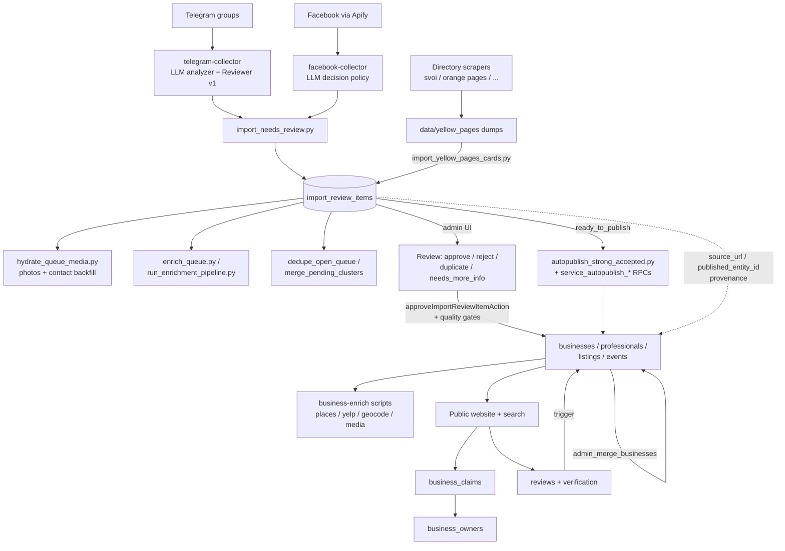
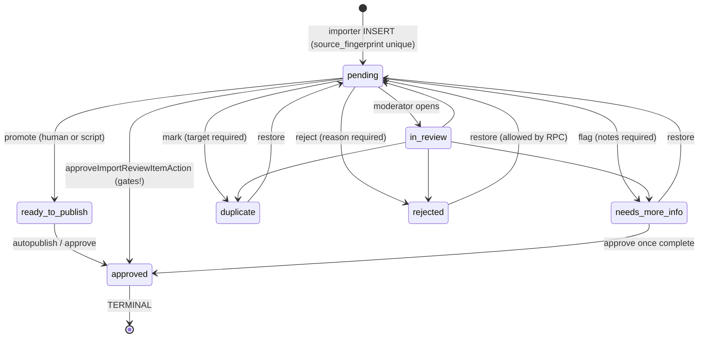

# PLATFORM LIFECYCLE V1

Runtime map of the platform: how every entity lives, what runs automatically, what
requires a human, and where the gaps are.

**Method:** everything below is verified against the live repo as of 2026-07-27 —
`supabase/migrations/` (105 files), `lib/`, `app/`, `scripts/`, and the existing
document corpus (`docs/architecture/entity-model-v1/`, `docs/audits/`). Nothing is
invented; where a designed process does not exist in code, it is listed under
**Validation Findings** or **Missing Runtime**, not described as if it ran.

**Reading order for a new developer:** §1 (what the systems are) → §5 (how data
enters) → §2–3 (how each entity lives) → §9–10 (what runs by itself) → §12–13
(what to distrust).

---

## 1. Runtime Overview

### 1.1 Subsystems that actually exist

| Subsystem | Where it lives | Runs as |
|---|---|---|
| **Collectors (Import)** | `scripts/telegram-collector/` (Telethon + LLM analyzer, cost-capped), `scripts/facebook-collector/` (Apify dataset → normalize → LLM decision policy), directory scrapers in `scripts/business-enrich/scrape_*.py` (svoi, orange pages, boston, echoru, our_texas, to4ka, zerkalo_mn, slavic_seattle, ruspagesusa) | manual CLI |
| **AI (collector side)** | `telegram-collector/llm_client.py` (OpenRouter/OpenAI, `CostTracker` with `load_max_cost_usd` hard cap), `telegram-collector/reviewer.py` (Reviewer v1: promote/keep/reject over needs_review), `facebook-collector/facebook_llm.py` + `facebook_decision_policy.py`, Gemini vision OCR in enrichment scripts (`enrich_places_fill_empty.py`, `enrich_from_telegram_source.py`, `summarize_professional_cards.py`, `fill_missing_addresses.py`) | manual CLI |
| **Import Review (queue)** | `import_review_items` + `import_review_audit` tables, RPCs `admin_import_review_set_status / save_fields / mark_approved / counts / write_audit`, `admin_list_import_review_items` (contact-priority ordering); admin UI `app/admin/import-review/`; queue scripts `scripts/import-review/*` | admin UI + manual CLI |
| **Publish** | `lib/import-review/actions.ts` `approveImportReviewItemAction` (human path, with per-type quality gates as of 2026-07-27); DB autopublish RPCs `service_autopublish_marketplace_listing`, `service_autopublish_specialist_service`, `service_import_review_mark_autopublished`; `scripts/import-review/autopublish_strong_accepted.py` (`--from-queue`) | admin UI / manual CLI |
| **Enrichment** | ~50 scripts in `scripts/business-enrich/` (fill-empty convention), `scripts/import-review/enrich_queue.py`, `scripts/media-pipeline/`, DB RPC `service_enrich_business_from_queue`, unified runner `run_enrichment_pipeline.py` (source_text → website → directories) | manual CLI |
| **Ownership / Claim** | `business_claims` + `business_owners` tables, `lib/claims/actions.ts` (self-claim), RPC `admin_review_business_claim`, `owns_business()` / `owns_professional()` / `can_manage_job()` helpers, admin UI `app/admin/claims/` | user UI + admin UI |
| **Duplicate Detection** | collector-side (`dedupe.py`, `entities.apply_global_deduplication`, `source_fingerprint` unique), queue-side (`dedupe_open_queue.py`, `merge_pending_clusters.py`, `merge_queue_into_existing.py`, `recurring_cluster_id`/`occurrence_count`), publish-side (`findDuplicateMatches` in `actions.ts`), entity-side (RPC `admin_merge_businesses`, `find_business_duplicates.py`, `merge_approved_duplicates.py`, `merge_professional_duplicates.py`) | mixed |
| **Search** | `app/search/` + `components/search/SearchResults` (DB queries via `lib/supabase/queries`), AI intent route `app/api/search/ai/route.ts` (OpenRouter paid-nano first, failover; spellcheck `lib/search/spellcheck.ts`, synonyms, rate limit + guard in `lib/security/`) | request-time |
| **Reviews / Reputation** | `reviews_mvp` migration: reviews, replies, reports, verification sessions (`create_verification_session` → `submit_verification_answer` → `complete_verification_session`), rating refresh trigger → `businesses.rating/reviews_count`, rate-limit triggers, `admin_set_review_moderation` | user UI + DB triggers |
| **Events (entity)** | `events` table (`draft/published/archived`), `lib/events/`, published from queue (`approveImportReviewItemAction`) and from recommendation mining (`facebook-collector/publish_recommendation_events.py`) | admin UI + manual CLI |
| **Marketplace / Listings** | `listings` + per-type detail tables (`marketplace_listing_details`, `service_listing_details`, `transfer_listing_details`, `lechu_listing_details`), DB state machine `transition_listing_status`, publish gate trigger `listings_validate_publish` | user UI + admin RPC |
| **Recommendations** | `import_comment_recommendations` table (chat-comment mining, `mention_count`, buckets, `directory_source`), `extract_telegram_recommendations.py`, `extract_comment_recommendations.py`, `publish_recommendation_catalog.py`, admin UI `app/admin/recommendations/` | manual CLI + admin UI |
| **Moderation** | `listing_reports` / `review_reports` + `admin_set_listing_report_status` / `admin_set_report_status`, `admin_set_listing_status`, `admin_set_business_status`, `admin_set_review_moderation` | admin UI |
| **Catalog / Master data** | `categories`, `listing_categories`, `platform_*` master tables (cities, counties, currencies, languages, features, data sources), `admin_upsert_*` / `admin_set_*_active` RPCs, admin UI `app/admin/master-data/` | admin UI |
| **Admin** | `app/admin/`: analytics, businesses, claims, directories, events, import-review, listings, master-data, recommendations, reviews, telegram-groups, users, yellow-pages | request-time |
| **Public Website** | `app/`: businesses, professionals, services, marketplace, jobs, events, transfers, lechu, vehicles, real-estate, map, search, profile, u/; hub/region resolution (`lib/regions/request-hub`), anti-scrape contact reveal (`get_professional_contacts` requires auth; `contact_reveal_metrics`), `sitemap.ts` | request-time |
| **Metrics** | `get_platform_resource_stats`, `popular_resource_scores`, `get_admin_platform_analytics`, contact-reveal metrics, engagement (`lib/platform/engagement.ts`) | request-time |
| **Entity Registry** | `entities` table + `entities_upsert` / `entities_delete_by_source`, sync triggers `trg_sync_entity_professional`, `trg_sync_entity_job`, view `entities_public` | DB triggers |

Subsystems that do **not** exist despite appearing in planning language: **Notifications**
(zero occurrences in code), **scheduler/queue/workers** (no pg_cron, no job table, no
worker process), **search index** (`search_logs` is mentioned in a schema comment but the
table was never created; search is live SQL). See §13.

### 1.2 How they connect



Everything on the left of `import_review_items` is **manual CLI**; everything to the
right of "Public website" is **request-time**. The only self-acting components are DB
triggers (§10).

---

## 2. Entity Lifecycles

Terminology note: each entity family has its own status enum today (see §3). The
canonical target vocabulary (`draft → pending → published ⇄ hidden → archived/expired/
rejected → deleted`) is defined in `ENTITY_BASE_MODEL.md` §3 and is **not yet what the
database speaks** — the per-entity tables below use the live values.

For each transition: **initiator** (who), **conditions** (guards), **events**
(what is recorded), **side effects**.

### 2.1 Business (`businesses`, `content_status`: draft / pending / approved / rejected / archived / deferred)

```text
(created) → approved ⇄ deferred
     │          │
     │          └→ archived (merge loser / admin)
     └ (draft/pending exist in the enum but no runtime path sets them today —
        imports insert directly as approved via admin/service paths)
```

| Transition | Initiator | Conditions | Events / side effects |
|---|---|---|---|
| queue item → business `approved` | Admin (approve action) or autopublish script | Quality gate (category + contact + description + image, `QUALITY_CARD_RULES_V1`); duplicate check passed or `force`; title resolvable | `admin_import_review_mark_approved` links `published_entity_id`; audit row in `import_review_audit`; `revalidatePath` on admin pages |
| admin upsert / seed → `approved` | Admin (`admin_upsert_business`) | admin role | updated_at trigger |
| `approved` → `deferred` | Admin (`admin_set_business_status`) | admin role | card leaves public surfaces (public queries filter `status='approved'`) |
| `approved` → `archived` | System, inside `admin_merge_businesses` (loser row) or admin status RPC | merge committed | children re-pointed to keep row first (§8) |
| enrichment updates | Scripts (fill-empty only) | field currently empty; source allowed by `ENRICHMENT_RULES_V1` | `updated_at` bumped; **no per-field provenance recorded** (known gap) |
| claim → owned | User + admin (§4) | pending claim approved | `business_owners` row; profile role upgrade |
| rating update | DB trigger `reviews_refresh_rating` | review written/hidden | `businesses.rating`, `reviews_count` recomputed |
| deleted | Admin (`admin_delete_business`) | admin role | hard delete; FK cascades |

There is **no automatic expiry, no automatic archive** for businesses.

### 2.2 Professional (`professionals`, `professional_status`: draft / pending / approved / rejected / archived / deferred)

| Transition | Initiator | Conditions | Events / side effects |
|---|---|---|---|
| self-service create → `draft` | Authenticated user | `can_publish()` (profile completed + verified contact) or admin | RLS: owner-only visibility while draft |
| queue publish → `approved` | Admin approve action (collection `private_specialists`) | gate: contact required; `category=other` needs `[human_confirmed]` | `published_at` stamped by trigger `trg_professionals_published_at` |
| any → `approved` | Admin | — | trigger stamps `published_at` once; registry sync trigger `trg_sync_entity_professional` upserts `entities` row (`published`) |
| `approved` → `archived` / `rejected` / `deferred` | Admin | — | registry row updated via sync trigger; card leaves `professionals_public` view |
| contact reveal | Any authenticated user | `status='approved' and visibility='public'` | `get_professional_contacts` RPC (anti-scrape: anon gets nothing) |
| enrichment | Scripts (card-first, svoi, orange-pages, avatars, card summaries) | fill-empty | same provenance gap as businesses |

`rating_avg` / `reviews_count` columns exist and are exposed publicly but **nothing writes
them** — the reviews subsystem is business-only (finding V-11).

### 2.3 MarketplaceItem (`listings` with `listing_type='marketplace_item'`, `listing_status`)

```text
draft → active ⇄ reserved → completed
  │        │
  │        ├→ expired / archived / removed
  │        └→ rejected (moderation)
```

| Transition | Initiator | Conditions | Events / side effects |
|---|---|---|---|
| create → `draft` | Owner (user UI) or approve action (admin-owned draft) | authenticated | `listings_log_create_event` trigger |
| `draft` → `active` | Owner via `transition_listing_status`, or admin via `admin_set_listing_status` | **DB gate** `listings_validate_publish`: city+state, details row, active category of right domain, price for `sell`, "looks like service" heuristic rejects misplaced services | queue-published items: `admin_set_listing_status(..., 'active', 'import_review_approved')` |
| `active` → `reserved`/`completed` | Owner | `reserved` forbidden for service-like types | — |
| `active` → `paused` | Owner | only service/transfer/transport_carry types | — |
| any → `removed`/`rejected` | Admin (moderation, report resolution) | — | report status updated |
| `expired` | **nobody** — no sweep exists (finding M-4) | — | — |

### 2.4 Job (`jobs`, status: draft / pending / published / archived / rejected / expired)

| Transition | Initiator | Conditions | Side effects |
|---|---|---|---|
| create → `draft` | Owner (business-linked) or admin | `can_manage_job()` | — |
| → `published` | Owner/admin | RLS `jobs_enforce_row` | `published_at` stamped by trigger; `trg_sync_entity_job` upserts `entities` registry row |
| queue publish | Admin approve action (collection `jobs`) → `listings` with `listing_type='job'` — **not** the `jobs` table | jobs left ungated in queue (compensation pipeline missing) | dual-home: user jobs live in `jobs`, imported jobs in `listings` (finding V-8) |
| `expired` | enum value exists; **no process sets it** | — | — |

### 2.5 Event (`events`, status: draft / published / archived)

| Transition | Initiator | Conditions | Side effects |
|---|---|---|---|
| queue publish → `published` | Admin approve action | gate: `[event_date_confirmed]` tag required in `review_notes` (starts_at is not extracted by the pipeline) | row inserted directly as `published`, `state_code='US-CA'` hardcoded |
| recommendation publish → `published` | `publish_recommendation_events.py` (manual CLI) | mined from FB/TG comment recommendations | — |
| `published` → `archived` | Admin | — | — |
| past-date handling | **nobody** — undated/past events stay published (flagged in `RECOMMENDATIONS_V1` §10) | — | — |

### 2.6 Transfer (`listings` with `listing_type='transfer'` + `transfer_listing_details`)

Same listing state machine as §2.3, with: `reserved` forbidden, `paused` allowed.
Queue path: target_collection `transfers` is **hard-blocked** at the approve gate
(fee_percent/fee_fixed not in pipeline data); historical rows were published via
`move_pros_to_lechu_transfers.py` + `publish_queue_lechu_transfers.sql` (manual batch).
The TS approve switch has **no** transfers branch — an ungated approval would fail with
"Неизвестная коллекция".

### 2.7 Lechu (`listings` with `listing_type='transport_carry'` + `lechu_listing_details`)

Identical mechanics to Transfer. Queue approvals hard-blocked (departure_date not
extracted). Published historical rows came from the same manual batch scripts.

### 2.8 Vehicle — **design-only entity**

- `entity_type` enum contains `vehicle`; `listing_type` enum contains `vehicle`.
- **No `vehicles` table exists in any migration.**
- `app/vehicles/page.tsx` queries `.from("vehicles")` inside try/catch — it renders an
  empty state on every request (finding V-6).
- No importer, no classifier output, no admin surface. Per `RECOMMENDATIONS_V1` P4:
  either build the entity or remove it from classifiers.

### 2.9 RealEstate — **frozen entity**

- Fully designed, unapplied: `REAL_ESTATE_ENTITY_V1.md` + draft
  `scripts/entity-model/001_additive_schema.sql`. Role split: agency → Business,
  individual realtor → Professional, unit for sale/rent → `real_estate_listings` (future).
- Live runtime as of 2026-07-27: any approve of `entity_type='real_estate'` or
  `target_collection='real_estate'` is **auto-frozen** — the action sets
  `needs_more_info` with note "RE table not ready. Wait for Phase 3"
  (`lib/import-review/actions.ts`). This replaced the old misroute that dumped RE into
  `listings` as `marketplace_item` (26 published rows from that era await a human pass —
  `PHASE_PLAN_V1` §3.3).

---

## 3. State Machines

### 3.1 Import review item (`import_review_status`, live enum — 7 values)



**Enforced in DB** (`admin_import_review_set_status`):
- `approved` is terminal: *"cannot change status of approved item"* — no unpublish path exists (differs from the designed workflow, see V-2).
- `rejected` requires `reject_reason`; `needs_more_info` requires notes; `duplicate` requires a target (item or entity).
- Every transition writes an `import_review_audit` row (action, from→to, payload, actor).

**Enforced in TS only** (`approveImportReviewItemAction`): quality gates per target type,
real-estate freeze, duplicate confirmation (`force` flag). The DB RPC `admin_import_review_mark_approved`
does **not** re-check gates — a service-role caller can bypass them (V-5).

**Requires a human:** everything except the autopublish scripts' `ready_to_publish → approved` hop.
**Auto-rollback:** none — no transition reverts automatically anywhere in this machine.

### 3.2 Listing (`listing_status` — DB-enforced)

Allowed (owner via `transition_listing_status`, compare-and-swap on `p_from`):
`draft→active` (publish gate trigger), `active⇄paused` (service-like only),
`active→reserved` (marketplace only), `reserved→active/completed`, any owner state →
`archived`. Admin (`admin_set_listing_status`) can force any state, including `rejected`
and `removed`.

Forbidden and DB-rejected: `reserved` for service/transfer/transport_carry; `paused` for
non-service-like; any transition where `p_from` doesn't match current row (optimistic-lock
error `P0001`); publish without required details/category/price (trigger raises).

Never automatic: `expired`, `completed`.

### 3.3 Professional / Job / Event / Business

- **Professional**: no DB transition function — status changed by owner/admin writes
  under RLS. Automatic pieces: `published_at` stamp on first `approved`; registry sync
  trigger on every write. `deferred` is a parking state (same idea as business
  `deferred`).
- **Job**: same pattern; `published_at` stamp trigger; registry sync trigger.
- **Event**: plain text check constraint; no triggers beyond `updated_at`.
- **Business**: `admin_set_business_status` RPC guards allowed values (incl. `deferred`
  since `20260725171452`); no owner-facing status control at all — owners edit fields,
  not lifecycle.

### 3.4 Designed-but-unimplemented states

`REVIEW_WORKFLOW_V1` defines 13 states (`imported`, `ai_classified`, `edited`, `merged`,
`archived` …). The live enum has 7. `ENTITY_TYPE_MAPPING_V1` explicitly maps legacy↔canonical
and says "until DB enum expands, UI/docs may show canonical labels while storing legacy
values." Treat the 13-state diagram as design intent, the 7-state RPC as reality.

---

## 4. Ownership Lifecycle

Three independent concepts (`OWNERSHIP_SOURCE_CLAIM.md`): **ownership** (who manages),
**source** (provenance, immutable), **claim** (the process converting a reader into an
owner). Only businesses have the full claim machinery today.

### 4.1 Business ownership

```text
unowned (imported) ──user submits claim──▶ business_claims: pending
    pending ──admin approve──▶ business_owners row + profiles.role → business_owner
    pending ──admin reject──▶ rejected (user may re-claim later)
    pending ──user cancel──▶ cancelled (RLS allows only status=cancelled self-update)
```

| Step | Initiator | Conditions | Side effects |
|---|---|---|---|
| create claim | Authenticated user (`claimBusinessAction`) | not already owner; no pending claim (partial unique index `business_claims_one_pending_idx`); proof = phone + ≥1 link (website/IG/FB/Yelp) | row with `verification_method='owner_self_claim'`; status forced to DB default `pending` (column INSERT denied) |
| approve | Admin (`admin_review_business_claim`) | claim is `pending`; admin role | `business_owners` upsert (role `owner`); profile role upgraded `user → business_owner`; `reviewed_by/at` stamped |
| reject | Admin, same RPC | pending; note optional | claim closed; **no notification to user** (nothing exists to send one) |
| cancel | User | own pending claim | RLS-constrained update to `cancelled` |
| owner edits | Owner | `owns_business()` (admins included since `20260725154148`) | inline edit grants (`20260725163946`) |
| ownership on merge | System (`admin_merge_businesses`) | — | owners of the losing row copied to keeper (dedup-aware), then deleted from loser; pending claims re-pointed |

**Verification of proof is entirely human** — the admin reads `verification_details`
(free text) in `app/admin/claims/`; no automated check calls the phone or fetches the links.

### 4.2 What does NOT exist (all confirmed absent; listed, not designed)

- **Ownership transfer** between users — no RPC, no UI. Only path is admin manually
  editing `business_owners`.
- **Ownership revocation / owner removal** — same.
- **Claims for professionals, events, listings** — professionals get ownership at
  creation (`owner_profile_id`) or never; imported professionals are unowned with no
  claim path. Listings are always owner-created (imported ones are owned by the
  approving admin — a provenance quirk worth knowing: `owner_id = admin`).
- **Effect of ownership on data**: owner edits win silently; enrichment scripts do not
  check ownership before writing (the "don't overwrite owner-claimed fields" rule in
  `ENRICHMENT_RULES_V1` is convention, not code).

---

## 5. Import Lifecycle

```text
Source (TG group / FB group / directory site)
  ↓  manual CLI, checkpointed, cost-capped
Collector  (run_full.py / run_facebook_collector.py / scrape_*.py)
  ↓  batch JSON in scripts/*/data/  — nothing touches the DB yet
AI pass 1: Analyzer      (entity extraction, contacts, categories; llm_v1)
AI pass 2: Reviewer v1   (needs_review only → promote_to_accepted | keep_review | reject)
  ↓  import_needs_review.py --apply   (idempotent by source_fingerprint)
import_review_items  (review_status = pending)
  ↓  queue maintenance (all manual): hydrate_queue_media.py (photos + tg contact backfill),
     enrich_queue.py / run_enrichment_pipeline.py, dedupe_open_queue.py,
     merge_pending_clusters.py, classify_null_queue.py (P1 2026-07-27:
     classification_confidence/reason columns)
  ↓
Classification: entity_type + target_collection set by classifiers or human
  ↓                                    ↓
Human review (admin UI)          ready_to_publish (strong cards)
  approve / reject / duplicate        ↓  autopublish_strong_accepted.py --from-queue
  / needs_more_info                   eligibility.py checks → service_autopublish_* RPCs
  ↓                                    ↓
Publish (§6) — entity row created, published_entity_{type,id} written back
  ↓
Enrichment (§7) — post-publish scripts match entity back to its queue row
  ↓
Public website (status/visibility-filtered views and queries)
```

Key invariants:
- **Provenance is preserved end-to-end**: `source_fingerprint` (unique), `source_url`,
  `source_text`, `raw_payload` (protected from update by trigger
  `protect_import_review_raw_payload`), and after publish `published_entity_type/id` on
  the queue row + `source_url`/`source_kind` on the entity.
- **Nothing moves without a human or a manually-run script.** There is no ingestion
  daemon; a Telegram post reaches the queue only when someone runs the collector and
  then the importer.
- Collector hard-limits: 6-month window enforced (`--allow-full-history` is rejected),
  LLM budget aborts via `CostTracker`.

---

## 6. Publish Lifecycle

Three publish paths exist; they do **not** share gate logic (V-5):

| Path | Trigger | Gates applied | Target |
|---|---|---|---|
| **Human approve** — `approveImportReviewItemAction` | admin clicks in UI | title resolvable; RE freeze; per-type quality gates (`QUALITY_CARD_RULES_V1`); contact-or-source_url; duplicate confirm | `businesses` (+ extras update), `professionals`, `listings` (marketplace/jobs → draft → `admin_set_listing_status` 'active'), `events` (direct `published`) |
| **Script autopublish** — `autopublish_strong_accepted.py --from-queue` | manual CLI | `eligibility.py`: direct contact, completeness, confidence ≥ thresholds, category resolvable | `service_autopublish_marketplace_listing` / `service_autopublish_specialist_service` RPCs, then `service_import_review_mark_autopublished` |
| **DB service RPCs** called directly | service-role scripts | whatever the RPC checks (autopublish supports only `SUPPORTED_AUTOPUBLISH_COLLECTIONS`) | same |

Post-publish invariant: queue row becomes `approved` (terminal), entity carries
`source_url`/`source_kind`, admin pages revalidated. For listings, the **DB trigger**
`listings_validate_publish` is the only gate that cannot be bypassed by any path.

Collections with no working publish path today: `transfers`, `lechu` (hard-gated + no
switch branch), `real_estate` (frozen), vehicle (no table).

---

## 7. Enrichment Lifecycle

Rules of the road (`ENRICHMENT_RULES_V1`, enforced by convention in scripts, not by the DB):

| Tier | Policy | Fields |
|---|---|---|
| A — never AI-generated | must come from source or stay empty | contacts, address, money, ratings, coordinates, identity |
| B — AI-assisted extraction from named official source only | Google Places, Yelp, official website, geocoder, Gemini OCR of the entity's own flyer photos (lower-trust, should be provenance-tagged) | hours, address parts, categories |
| C — AI may synthesize freely from the entity's own text | `card_summary`, description merges | narrative copy |

**What can trigger enrichment:** only a human running a script. Inventory of trigger
points:
- Queue-side: `enrich_queue.py`, `hydrate_queue_media.py`, `run_enrichment_pipeline.py`
  (new 2026-07-27: source_text → website → directories, batches of 50, fill-empty,
  dry-run default).
- Entity-side: `enrich_from_import_sources.py` (queue payload → business),
  `enrich_places_fill_empty.py` (Google Places), `fill_yelp_ratings.py`,
  `geocode_all_addresses.py`, `enrich_published_businesses.py` (own-website scrape),
  media pipeline (`run_media_pipeline.py` → storage + `service_set_business_auto_image`),
  professional card scripts (svoi/orange-pages/card-first/avatars/summaries).
- DB-side: `service_enrich_business_from_queue` RPC (used by queue-attach flows).

**Immutable by convention:** anything already non-empty (fill-empty-only), `raw_payload`
(trigger-protected — the only DB-enforced immutability), source fields
(`source_url`, `source_fingerprint`).

**Trusted sources:** own queue payload (Telegram/Facebook original post), the entity's own
website, Google Places, Yelp, geocoder output, curated local directory dumps
(`data/yellow_pages/*_latest.json`). Guards: `JUNK_HOST_PARTS` +
`PLATFORM_HOSTS` (a recommended third-party site like vistaprint.com must not donate its
own contacts).

**Known enforcement gap:** no per-field provenance column exists, so after the fact you
cannot prove which script wrote which value (`DATA_CLEANUP_PLAN_V1` §3.3). Completeness
scoring (`completeness_score.py`, backfilled for all approved rows 2026-07-27) is the
only quantitative trace of enrichment effect.

---

## 8. Duplicate Lifecycle

**Detection — three layers, three codebases (no shared logic):**
1. Collector: per-batch `dedupe.py` + global `apply_global_deduplication` before anything
   reaches the DB; `source_fingerprint` unique index is the hard backstop.
2. Queue: `recurring_cluster_id` + `occurrence_count` + `first_seen/last_seen` track
   reposts; `dedupe_open_queue.py`, `merge_pending_clusters.py`,
   `merge_queue_into_existing.py`, `purge_linked_duplicates.py` (all manual).
3. Publish-time: `findDuplicateMatches` (TS) — exact phone / telegram id / username /
   instagram / website vs live entities and open queue, plus name similarity; blocking
   unless `force`.

**Clustering:** queue rows only (`recurring_cluster_id`). No clustering for published
entities — entity-level duplicates are found by batch scripts
(`find_business_duplicates.py`, `find_duplicates.py`) and merged by hand.

**Merge (businesses):** RPC `admin_merge_businesses(p_keep_id, p_drop_id)` —
re-points `business_offers` (slug-collision-safe), copies `business_owners`
(conflict-aware), re-points pending `business_claims` and `reviews` (skipping
would-be duplicates), archives the losing row (`status='archived'`), returns a JSON
summary (`reviews_moved`, …). Professionals: `merge_professional_duplicates.py` script.

**Conflicts:** keep-row values win; no field-level merge UI exists.

**Rollback:** none. The loser is archived (not deleted), so a manual un-merge is
*possible* from data, but no tool exists; the RPC's JSON summary is the only record of
what moved (it is returned to the caller, not persisted). Queue-side duplicate marking IS
reversible (`duplicate → pending` restore).

**Provenance:** queue duplicates keep `duplicate_of_item_id` / `duplicate_of_entity_type`
/ `duplicate_of_entity_id`; every status change is in `import_review_audit`. Entity
merges have **no audit table** (finding M-7).

---

## 9. Background Runtime

The honest inventory: **the platform has no autonomous background runtime.**

| Claimed/expected process | Reality |
|---|---|
| Cron | No pg_cron in any migration; no Vercel cron config; no CI schedules |
| Queue / workers | None — `import_review_items` is a human queue, not a job queue |
| Import jobs | Manual CLI (collectors, `import_needs_review.py`), checkpoint files for resume |
| Enrichment | Manual CLI, dry-run-first convention, JSON reports under `scripts/*/data/` |
| Reindex / search index | No index exists; search is live SQL + in-request AI intent |
| AI processing | Only inside manually-run collector/enrichment scripts and the request-time `/api/search/ai` route |
| Cleanup | `expire_stale_verifications()` exists in SQL but is **called only from a test script** (`scripts/reviews-rls-checks.sql`) — never scheduled. Storage GC for orphaned media: `listing_media_cleanup_storage` trigger handles listing media deletes; nothing sweeps `business-images` |
| Notification jobs | No notification system exists at all |
| Metrics | Computed at request time by RPCs (`get_platform_resource_stats`, `popular_resource_scores`); no materialization or snapshot job |
| Health checks | None found |
| Review queue refresh | Counts computed live by `admin_import_review_counts` |

What IS automatic — **DB triggers** (complete list of behavior-bearing ones):
`reviews_refresh_rating` (ratings onto businesses), `reviews_rate_limit_before_write` +
report rate limits, `listings_validate_publish` (publish gate),
`listing_favorites_adjust_count`, `listing_media_cleanup_storage`,
`trg_professionals_published_at` / jobs equivalent (published_at stamps),
`trg_sync_entity_professional` / `trg_sync_entity_job` (registry sync),
`protect_import_review_raw_payload`, `touch_import_review_updated_at`, the
`*_set_updated_at` family, `handle_new_user` (profile bootstrap on signup), and the
reviews/listings event-log triggers (`reviews_log_write_event`,
`listing_reports_log_event`, `listings_log_create_event`).

Consequence: every "cadence" behavior the docs imply (expiry, refresh, re-enrichment,
requeue) happens only when a human remembers to run it. This is the single biggest
architectural risk area (§13, §14).

---

## 10. Event Model

There is **no event bus, no domain-event table, no pub/sub**. "Events" exist in three
concrete forms:

1. **Audit rows**: `import_review_audit` (every queue transition, actor, from→to,
   payload) — the closest thing to a domain-event log, scope: import review only.
2. **Trigger side effects** (§9 list) — synchronous, in-transaction, no listeners beyond
   the trigger body.
3. **Request-time revalidation**: `revalidatePath` calls after admin actions (cache
   invalidation, not events).

Mapping the *requested* canonical events to reality:

| Domain event | Exists as | Publisher | Listener |
|---|---|---|---|
| BusinessCreated | row INSERT (+`listings_log_create_event` analog exists only for listings) | approve action / admin RPC / scripts | none |
| BusinessPublished | `status='approved'` write | same | public queries (implicit) |
| BusinessClaimed | `business_claims` INSERT → `admin_review_business_claim` | user → admin | none (no notification) |
| ProfessionalPublished | `status='approved'` + `published_at` stamp + registry upsert | admin/owner | `trg_sync_entity_professional` |
| ReviewApproved / written | `reviews` INSERT/moderation RPC | user/admin | `reviews_refresh_rating` trigger |
| DuplicateMerged | `admin_merge_businesses` return JSON | admin | none (not persisted) |
| ImportCompleted | collector batch JSON + checkpoint file | CLI | none |
| EntityArchived | status write | admin/merge RPC | none |
| OwnershipTransferred | **no such operation exists** | — | — |
| EnrichmentCompleted | JSON report file in `scripts/*/data/` + `FABLE_RUN_LOG.txt` entries | CLI | none |
| NotificationSent | **nothing to send, nothing sent** | — | — |

Design consequence: any future subsystem that needs to *react* to a lifecycle change
(notifications, reindex, webhooks) currently has nothing to subscribe to except polling
tables or adding more triggers.

---

## 11. Cross-System Dependencies

- **Queue → everything**: `import_review_items` is the provenance root; enrichment
  matches entities back to it by `published_entity_id` / normalized `source_url`
  (`enrich_from_import_sources.py`). Deleting queue rows would orphan provenance.
- **Reviews → Businesses**: rating trigger writes into `businesses`; reviews'
  verification engine depends on the unscheduled expiry function (V-9).
- **Claims → Profiles**: approval mutates `profiles.role` (uses the
  `app.allow_role_change` escape hatch around the role-lock trigger).
- **Registry (`entities`) → Professionals+Jobs only**: search/registry consumers must not
  assume businesses/listings/events are registered (V-7).
- **Master data → publish gates**: `listings_validate_publish` requires an *active*
  `listing_categories` row of the right domain — deactivating a category silently blocks
  publishing in that category.
- **Hubs/regions → all public queries**: `resolveRequestHubs` + hub cookie shape every
  public list; imported entities without region mapping fall out of hub-scoped surfaces.
- **AI budget → collectors**: `CostTracker` aborts batches mid-run; checkpoint/resume is
  the recovery path.
- **Storage buckets ↔ rows**: listing media has delete-cleanup; `business-images`
  (incl. `import-review/{item_id}/…` from `hydrate_queue_media.py`) has no GC tie.

---

## 12. Validation Findings (cross-document, cross-code)

| # | Finding | Evidence |
|---|---|---|
| V-1 | **Designed 13-state review workflow vs live 7-state enum.** `edited`, `merged`, `archived`, `imported`, `ai_classified` don't exist in the DB; the alias table itself acknowledges this. | `REVIEW_WORKFLOW_V1` §1 vs `import_review_status` enum; `ENTITY_TYPE_MAPPING_V1` §status aliases |
| V-2 | **`approved` is terminal in DB, but the designed machine allows `published → needs_review` (gated restore/unpublish).** No unpublish exists in runtime. | `admin_import_review_set_status` raises on leaving `approved` |
| V-3 | **Same lifecycle concept, five different vocabularies**: business `approved`, professional `approved`, job `published`, event `published`, listing `active`, registry `published`. `ENTITY_BASE_MODEL` §3 documents the target mapping but no table was converged. | enums in §3 |
| V-4 | **Two enums share the word `deferred` with unstated equivalence** (`content_status.deferred`, `professional_status.deferred`); base model maps business-`deferred`→`hidden` conceptually. | migrations `20260725171452`, `20260726171559` |
| V-5 | **Publish gates exist only on the TS human path.** `admin_import_review_mark_approved`, `service_autopublish_*`, and the python autopublish apply their own (weaker/different) checks; only listings have a DB-level gate. A service-role caller can publish a gateless business. | §6 table |
| V-6 | **Vehicle is a dead surface**: `app/vehicles/page.tsx` queries a table that no migration creates; enum values exist in `entity_type` and `listing_type`; also `listing_type.resume` has no UI/importer at all. | §2.8 |
| V-7 | **Entity registry is partial**: `entities` promises the 9-type domain enum but only professionals and jobs sync into it. `entities_public` is not a platform-wide registry view. | `20260726171559`, `20260726173458` |
| V-8 | **Jobs are dual-homed**: user-created jobs → `jobs` table; queue-published jobs → `listings(listing_type='job')`. Public jobs surfaces must merge two sources; status vocabularies differ. | §2.4 |
| V-9 | **`expire_stale_verifications` is never scheduled or called by app code** — stale review-verification sessions live forever in production. | only caller: `scripts/reviews-rls-checks.sql` |
| V-10 | **`search_logs` is referenced in the core-schema comment but the table was never created**; no search logging exists. | `20260717175146` header comment |
| V-11 | **Professionals expose `rating_avg`/`reviews_count` publicly but nothing writes them** — the reviews subsystem is wired to businesses only. | `professionals_public` view vs `reviews_mvp` |
| V-12 | **Real-estate contradiction now resolved in code but history remains in data**: 21 businesses + 5 listings published under the old misroute need the human pass already scoped in `PHASE_PLAN_V1` §3.3. | §2.9 |
| V-13 | **Naming**: the same queue process is called "Import Review", "Review Center" (`ADMIN_REVIEW_CENTER_V1`), and "Reviewer" (collector-side AI pass). The collector's "Reviewer v1" is a *different system* from human review — easy onboarding trap. | doc titles |
| V-14 | **`import_review_status` TS type matches DB (7 values incl. `ready_to_publish`) but TS `ImportReviewEntityType` lacks `vehicle` while the DB domain `entity_type` enum includes it** — a queue row can never target the vehicle type the registry advertises. | `types/import-review.ts` vs `20260726171559` |
| V-15 | **Merge has no audit**: `admin_merge_businesses` returns a JSON summary that is not persisted anywhere; queue transitions are audited, entity merges are not. | §8 |
| V-16 | **Schema drift outside migrations**: `listing_type` values `transfer`/`transport_carry` were added directly to the live DB — `20260721172000` opens with "enums already added in prior statement" but no tracked migration contains the `alter type`. A fresh environment built from migrations would fail to seed lechu/transfer categories. | Appendix A |

Dead states (enum values no runtime path sets): business `draft`/`pending`;
listing `expired`; job `expired`, job `pending` (no moderation flow for jobs);
registry `pending`/`hidden` (sync triggers map only the implemented statuses).

---

## 13. Missing Runtime (gaps only — no solutions designed here)

1. **Scheduling of any kind** — no cron/queue/worker; every periodic behavior is a human.
2. **Notifications** — no tables, no senders, no templates; claim decisions, review
   replies, publish results are silently invisible to users.
3. **Expiry sweeps** — listings/jobs `expired`, stale verification sessions, past events,
   `expires_at` on queue rows: all unenforced.
4. **Search indexing** — no index, no logs, no reindex process; scaling story undefined.
5. **Ownership transfer / revocation** — no process (§4.2).
6. **Claim evidence verification** — procedure is entirely "admin reads free text";
   nothing defines what proof is sufficient.
7. **Un-merge / merge audit** — no rollback tool, no persisted merge log.
8. **Per-field provenance** — enrichment writes are unattributable after the fact.
9. **Media garbage collection** for `business-images` (incl. queue previews of rejected
   items).
10. **Entity archival/retention policy** — nothing defines when approved-but-dead cards
    leave public surfaces.
11. **Vehicle & RealEstate runtime** — advertised in enums/pages, no storage or flow
    (RE is at least explicitly frozen; vehicle is silently empty).
12. **Monitoring/health/alerting** — no checks anywhere.
13. **User-data deletion flow** (account deletion → owned content) — `handle_new_user`
    exists for signup; no teardown counterpart is described or implemented.
14. **Backpressure/limits for the manual pipeline** — nothing prevents the queue from
    growing faster than humans review it (2,738 `[needs_manual_type]` rows today prove
    it happens).

---

## 14. Recommendations

Ordered by leverage, all consistent with the freeze (no schema invention here — items
needing schema go through their own workstream):

1. **Converge publish gates at the DB boundary.** Today's quality gates live in one TS
   function; the autopublish RPCs should call the same checks (a `publish_gate_errors`
   SQL function or a single RPC used by both paths). Until then, treat script publishes
   as gate-bypassing (V-5).
2. **Introduce the smallest possible scheduler** (even a single external cron hitting
   `expire_stale_verifications`, expiry sweeps, and past-event archiving) before adding
   any new "background" features — §13 items 1/3 unblock several findings at once.
3. **Persist merge summaries** — `admin_merge_businesses` already builds the JSON;
   writing it to `import_review_audit`-style storage closes V-15 cheaply.
4. **Decide vehicle's fate** (build or remove from enums/classifiers/pages) — it is the
   only subsystem that *looks* live to a user while being storage-less (V-6, matches
   `RECOMMENDATIONS_V1` P4).
5. **Unify the jobs home** before the jobs quality gate is turned on (V-8): the gate
   pipeline (`employment_type`/compensation) only makes sense against one table.
6. **Adopt the `ENTITY_BASE_MODEL` status mapping in one shared helper**
   (`is_publicly_listed(status, visibility)` per its own recommendation) instead of the
   five per-table filters now embedded in views/queries (V-3).
7. **When the DB enum grows toward the 13-state workflow**, add `archived` first — it is
   the state most transitions in `REVIEW_WORKFLOW_V1` terminate in and the only one whose
   absence forces terminal `approved` (V-1/V-2).
8. **Document the two "Reviewers" apart** (collector AI pass vs human review center) in
   onboarding materials (V-13) — zero code cost, removes the worst naming trap.

---

## Appendix A. Status enums (live, verbatim)

| Enum | Values |
|---|---|
| `content_status` (businesses) | draft, pending, approved, rejected, archived, deferred |
| `professional_status` | draft, pending, approved, rejected, archived, deferred |
| `listing_status` | draft, active, paused, reserved, completed, expired, archived, removed, rejected |
| jobs.status (check constraint) | draft, pending, published, archived, rejected, expired |
| events.status (check constraint) | draft, published, archived |
| `import_review_status` | pending, in_review, approved, rejected, duplicate, needs_more_info, ready_to_publish |
| `entity_registry_status` | draft, pending, published, rejected, archived, hidden |
| `business_claim_status` | pending, approved, rejected, cancelled |
| `entity_type` (registry) | business, professional, marketplace_item, job, vehicle, real_estate, event, lechu, transfer |
| `listing_type` | marketplace_item, service, job, resume, vehicle, transfer, transport_carry — the last two were added to the live DB outside the tracked migration files (`20260721172000` opens with "enums already added in prior statement"); a fresh `db reset` from migrations alone would not have them |

## Appendix B. Document cross-reference

| Topic | Canonical doc |
|---|---|
| Designed review state machine | `entity-model-v1/REVIEW_WORKFLOW_V1.md` |
| Status vocabulary target | `entity-model-v1/ENTITY_BASE_MODEL.md` §3 |
| Alias mappings (types & statuses) | `entity-model-v1/ENTITY_TYPE_MAPPING_V1.md` |
| Ownership/source/claim concepts | `entity-model-v1/OWNERSHIP_SOURCE_CLAIM.md` |
| Enrichment tiers & stop-list | `audits/ENRICHMENT_RULES_V1.md` |
| Publish quality gates | `audits/QUALITY_CARD_RULES_V1.md` |
| Field survival source→web | `audits/PIPELINE_AUDIT_V1.md` |
| Cleanup phases & RE plan | `audits/PHASE_PLAN_V1.md`, `audits/DATA_CLEANUP_PLAN_V1.md` |
| This run's change log | `audits/FABLE_RUN_LOG.txt` |

---

## Addendum 2026-07-27 — ARCHITECTURE_STABILIZATION_V1

Findings status after the stabilization stage (see
[ARCHITECTURE_STABILIZATION_V1.md](./ARCHITECTURE_STABILIZATION_V1.md)):

| Finding | Status |
|---|---|
| V-5 (gates only in TS) | **CLOSED** — single DB gate `import_review_publish_gate_errors`, backstopped inside both mark-approved RPCs |
| V-8 (jobs dual-home) | **CLOSED** — queue jobs now publish into `jobs`; 0 legacy rows existed in `listings` |
| V-9 (verification expiry never runs) | **Entry point ready** — `run_scheduled_maintenance()`; still needs an external cron to call it |
| V-15 (merge unaudited) | **CLOSED** — merge summary persisted as `business.merged` domain event |
| V-16 (listing_type enum drift) | **CLOSED** — repair migration |
| §10 event model | **Outbox exists** — `domain_events` table + `emit_domain_event()`; consumers still to be built |
