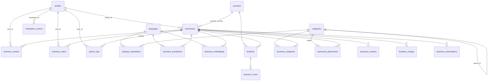

# Структура базы данных — Russian Business AI

Проект схемы для Supabase (PostgreSQL 15+). SQL в конце документа — предложение, **не применён**.

## Архитектурные принципы

1. **Мультиязычность** — весь переводимый контент вынесен в таблицы `*_translations`. Добавление языка = добавление строк, не колонок.
2. **Мультистрановость** — справочник `countries`, все адреса привязаны к стране. Добавление страны = строка в справочнике.
3. **Несколько локаций у бизнеса** — адреса, координаты и часы работы привязаны к `locations`, а не к `businesses`.
4. **Универсальные контакты** — телефоны, сайт, email и соцсети хранятся в одной таблице `business_contacts` с типом. Новый канал связи = новое значение enum.
5. **AI-поиск** — эмбеддинги в отдельной таблице `business_embeddings` (pgvector). Модель или размерность можно менять без миграции основных таблиц.
6. **Модерация как сквозной механизм** — у контента (бизнесы, отзывы, фото, заявки) есть поле `status`, история решений — в `moderation_actions`.
7. **Монетизация отделена от контента** — premium (`business_subscriptions`) и спонсируемые места (`sponsored_placements`) не трогают структуру `businesses`.
8. **Денормализованные счётчики** (`rating_avg`, `reviews_count`) обновляются триггером — быстрые выборки без пересчёта на каждый запрос.
9. **Пользователи** — `auth.users` управляется Supabase Auth; публичный профиль и роль — в `profiles`. Роль хранится и в `app_metadata` (не в `user_metadata`) для RLS.
10. **RLS включается на всех таблицах** схемы `public`.

## Расширения

| Расширение | Назначение |
|---|---|
| `postgis` | Гео-координаты, поиск «рядом со мной» |
| `vector` (pgvector) | Эмбеддинги для AI-поиска |
| `pg_trgm` | Нечёткий текстовый поиск по названиям |
| `unaccent` | Поиск без учёта диакритики |

## ENUM-типы

| Тип | Значения |
|---|---|
| `user_role` | `user`, `business_owner`, `moderator`, `admin` |
| `content_status` | `draft`, `pending`, `approved`, `rejected`, `archived` |
| `contact_type` | `phone`, `email`, `website`, `telegram`, `whatsapp`, `instagram`, `facebook`, `vk`, `youtube`, `other` |
| `claim_status` | `pending`, `approved`, `rejected` |
| `subscription_plan` | `free`, `premium`, `premium_plus` |
| `subscription_status` | `active`, `past_due`, `canceled`, `expired` |
| `placement_type` | `search_top`, `home_featured`, `category_top`, `map_pin` |
| `moderation_entity` | `business`, `review`, `image`, `claim` |

---

## Таблицы

### 1. `profiles`

**Назначение:** публичный профиль пользователя, расширяет `auth.users` (1:1).

| Поле | Тип | Описание |
|---|---|---|
| `id` | `uuid` | PK, FK → `auth.users(id) ON DELETE CASCADE` |
| `display_name` | `text` | Имя для отображения |
| `avatar_url` | `text` | Ссылка на аватар (Storage) |
| `role` | `user_role` | Роль, default `user` (дублируется в `app_metadata`) |
| `preferred_language` | `text` | FK → `languages(code)`, nullable |
| `created_at` | `timestamptz` | default `now()` |
| `updated_at` | `timestamptz` | default `now()` |

- **PK:** `id`
- **Индексы:** `role`

### 2. `countries`

**Назначение:** справочник стран присутствия каталога.

| Поле | Тип | Описание |
|---|---|---|
| `code` | `text` | PK, ISO 3166-1 alpha-2 (`US`, `DE`, `IL`) |
| `name` | `text` | Название на английском |
| `default_language` | `text` | FK → `languages(code)` |
| `is_active` | `boolean` | default `true` |

- **PK:** `code`

### 3. `languages`

**Назначение:** справочник языков интерфейса и контента.

| Поле | Тип | Описание |
|---|---|---|
| `code` | `text` | PK, BCP 47 (`ru`, `en`, `de`, `he`) |
| `name` | `text` | Самоназвание («Русский») |
| `is_active` | `boolean` | default `true` |

- **PK:** `code`

### 4. `categories`

**Назначение:** иерархический справочник категорий бизнеса. Названия — в `category_translations`.

| Поле | Тип | Описание |
|---|---|---|
| `id` | `uuid` | PK, default `gen_random_uuid()` |
| `slug` | `text` | URL-идентификатор, уникальный |
| `parent_id` | `uuid` | FK → `categories(id) ON DELETE SET NULL`, nullable (иерархия) |
| `icon` | `text` | Имя иконки (Lucide), nullable |
| `sort_order` | `integer` | default `0` |
| `is_active` | `boolean` | default `true` |
| `created_at` | `timestamptz` | default `now()` |

- **PK:** `id`
- **Unique:** `slug`
- **Индексы:** `parent_id`

### 5. `category_translations`

**Назначение:** переводы категорий.

| Поле | Тип | Описание |
|---|---|---|
| `category_id` | `uuid` | FK → `categories(id) ON DELETE CASCADE` |
| `language_code` | `text` | FK → `languages(code)` |
| `name` | `text` | Название |
| `description` | `text` | nullable |

- **PK:** составной `(category_id, language_code)`
- **Индексы:** `language_code`, trigram GIN по `name`

### 6. `businesses`

**Назначение:** ядро каталога — карточка бизнеса. Переводимый контент — в `business_translations`, адреса — в `locations`.

| Поле | Тип | Описание |
|---|---|---|
| `id` | `uuid` | PK, default `gen_random_uuid()` |
| `slug` | `text` | URL-идентификатор, уникальный |
| `owner_id` | `uuid` | FK → `profiles(id) ON DELETE SET NULL`, nullable (заполняется после подтверждения владельца) |
| `status` | `content_status` | default `pending` (модерация) |
| `is_verified` | `boolean` | default `false` (владелец подтверждён) |
| `primary_country` | `text` | FK → `countries(code)` |
| `rating_avg` | `numeric(3,2)` | default `0`, денормализация (триггер) |
| `reviews_count` | `integer` | default `0`, денормализация (триггер) |
| `price_level` | `smallint` | 1–4, nullable |
| `founded_year` | `smallint` | nullable |
| `attributes` | `jsonb` | default `'{}'` — гибкие атрибуты (доставка, парковка и т.п.) без миграций |
| `created_by` | `uuid` | FK → `profiles(id)`, nullable — кто добавил карточку |
| `created_at` | `timestamptz` | default `now()` |
| `updated_at` | `timestamptz` | default `now()` |

- **PK:** `id`
- **Unique:** `slug`
- **Индексы:** `status`, `primary_country`, `owner_id`, `rating_avg DESC`, GIN по `attributes`

### 7. `business_translations`

**Назначение:** название и описание бизнеса на каждом языке.

| Поле | Тип | Описание |
|---|---|---|
| `business_id` | `uuid` | FK → `businesses(id) ON DELETE CASCADE` |
| `language_code` | `text` | FK → `languages(code)` |
| `name` | `text` | Название |
| `short_description` | `text` | nullable, для карточек в списке |
| `description` | `text` | nullable, полное описание |
| `is_auto_translated` | `boolean` | default `false` — машинный перевод (можно перегенерировать) |

- **PK:** составной `(business_id, language_code)`
- **Индексы:** `language_code`, trigram GIN по `name` — нечёткий поиск

### 8. `business_categories`

**Назначение:** связь many-to-many бизнес ↔ категория.

| Поле | Тип | Описание |
|---|---|---|
| `business_id` | `uuid` | FK → `businesses(id) ON DELETE CASCADE` |
| `category_id` | `uuid` | FK → `categories(id) ON DELETE CASCADE` |
| `is_primary` | `boolean` | default `false` — главная категория |

- **PK:** составной `(business_id, category_id)`
- **Индексы:** `category_id` (выборка «все бизнесы категории»)

### 9. `locations`

**Назначение:** физические адреса бизнеса (один бизнес — несколько точек). Гео-поиск идёт по этой таблице.

| Поле | Тип | Описание |
|---|---|---|
| `id` | `uuid` | PK, default `gen_random_uuid()` |
| `business_id` | `uuid` | FK → `businesses(id) ON DELETE CASCADE` |
| `country_code` | `text` | FK → `countries(code)` |
| `city` | `text` | Город |
| `region` | `text` | Штат/область, nullable |
| `postal_code` | `text` | nullable |
| `address_line` | `text` | Улица, дом |
| `address_extra` | `text` | Офис/этаж, nullable |
| `geog` | `geography(Point, 4326)` | Координаты (PostGIS), nullable до геокодинга |
| `timezone` | `text` | IANA (`America/New_York`), для корректного «открыто сейчас» |
| `is_primary` | `boolean` | default `false` |
| `created_at` | `timestamptz` | default `now()` |

- **PK:** `id`
- **Индексы:** `business_id`, `(country_code, city)`, **GIST по `geog`** — поиск «рядом»

### 10. `business_hours`

**Назначение:** часы работы по каждой локации.

| Поле | Тип | Описание |
|---|---|---|
| `id` | `uuid` | PK, default `gen_random_uuid()` |
| `location_id` | `uuid` | FK → `locations(id) ON DELETE CASCADE` |
| `day_of_week` | `smallint` | 0–6 (0 = воскресенье), CHECK |
| `opens_at` | `time` | nullable |
| `closes_at` | `time` | nullable |
| `is_closed` | `boolean` | default `false` — выходной |

- **PK:** `id`
- **Unique:** `(location_id, day_of_week, opens_at)` — допускает два интервала в день (перерыв на обед)
- **Индексы:** `location_id`

### 11. `business_contacts`

**Назначение:** все контакты бизнеса — телефоны (несколько), сайт, email, соцсети.

| Поле | Тип | Описание |
|---|---|---|
| `id` | `uuid` | PK, default `gen_random_uuid()` |
| `business_id` | `uuid` | FK → `businesses(id) ON DELETE CASCADE` |
| `type` | `contact_type` | Вид контакта |
| `value` | `text` | Номер / URL / handle |
| `label` | `text` | nullable («отдел продаж») |
| `is_primary` | `boolean` | default `false` |
| `sort_order` | `integer` | default `0` |

- **PK:** `id`
- **Unique:** `(business_id, type, value)` — без дублей
- **Индексы:** `business_id`

### 12. `business_images`

**Назначение:** фотографии бизнеса (файлы — в Supabase Storage, здесь метаданные).

| Поле | Тип | Описание |
|---|---|---|
| `id` | `uuid` | PK, default `gen_random_uuid()` |
| `business_id` | `uuid` | FK → `businesses(id) ON DELETE CASCADE` |
| `storage_path` | `text` | Путь в бакете Storage |
| `alt_text` | `text` | nullable |
| `is_cover` | `boolean` | default `false` |
| `sort_order` | `integer` | default `0` |
| `status` | `content_status` | default `pending` — модерация фото |
| `uploaded_by` | `uuid` | FK → `profiles(id)`, nullable |
| `created_at` | `timestamptz` | default `now()` |

- **PK:** `id`
- **Unique:** `storage_path`
- **Индексы:** `(business_id, status)`

### 13. `business_reviews`

**Назначение:** отзывы и оценки. Рейтинг бизнеса агрегируется триггером в `businesses`.

| Поле | Тип | Описание |
|---|---|---|
| `id` | `uuid` | PK, default `gen_random_uuid()` |
| `business_id` | `uuid` | FK → `businesses(id) ON DELETE CASCADE` |
| `user_id` | `uuid` | FK → `profiles(id) ON DELETE CASCADE` |
| `rating` | `smallint` | 1–5, CHECK |
| `title` | `text` | nullable |
| `body` | `text` | nullable |
| `language_code` | `text` | FK → `languages(code)`, язык отзыва |
| `status` | `content_status` | default `pending` — модерация |
| `owner_reply` | `text` | nullable — ответ владельца |
| `owner_reply_at` | `timestamptz` | nullable |
| `created_at` | `timestamptz` | default `now()` |
| `updated_at` | `timestamptz` | default `now()` |

- **PK:** `id`
- **Unique:** `(business_id, user_id)` — один отзыв на бизнес от пользователя
- **Индексы:** `(business_id, status)`, `user_id`

### 14. `business_claims`

**Назначение:** заявки «я владелец этого бизнеса». После одобрения заполняются `businesses.owner_id` и `is_verified`.

| Поле | Тип | Описание |
|---|---|---|
| `id` | `uuid` | PK, default `gen_random_uuid()` |
| `business_id` | `uuid` | FK → `businesses(id) ON DELETE CASCADE` |
| `user_id` | `uuid` | FK → `profiles(id) ON DELETE CASCADE` |
| `status` | `claim_status` | default `pending` |
| `evidence` | `jsonb` | default `'{}'` — документы, способ верификации |
| `reviewed_by` | `uuid` | FK → `profiles(id)`, nullable — модератор |
| `reviewed_at` | `timestamptz` | nullable |
| `created_at` | `timestamptz` | default `now()` |

- **PK:** `id`
- **Unique:** частичный `(business_id, user_id) WHERE status = 'pending'` — не более одной активной заявки
- **Индексы:** `status`, `business_id`

### 15. `business_subscriptions`

**Назначение:** Premium-подписки бизнеса. История хранится (новая строка на каждый период).

| Поле | Тип | Описание |
|---|---|---|
| `id` | `uuid` | PK, default `gen_random_uuid()` |
| `business_id` | `uuid` | FK → `businesses(id) ON DELETE CASCADE` |
| `plan` | `subscription_plan` | Тариф |
| `status` | `subscription_status` | default `active` |
| `starts_at` | `timestamptz` | Начало периода |
| `ends_at` | `timestamptz` | Конец периода, nullable (бессрочно) |
| `external_ref` | `text` | nullable — id в платёжной системе (Stripe) |
| `created_at` | `timestamptz` | default `now()` |

- **PK:** `id`
- **Индексы:** `(business_id, status)`, `ends_at`

### 16. `sponsored_placements`

**Назначение:** платные позиции в выдаче (топ поиска, главная, категория, карта).

| Поле | Тип | Описание |
|---|---|---|
| `id` | `uuid` | PK, default `gen_random_uuid()` |
| `business_id` | `uuid` | FK → `businesses(id) ON DELETE CASCADE` |
| `placement` | `placement_type` | Где показывать |
| `country_code` | `text` | FK → `countries(code)`, nullable — таргет по стране |
| `category_id` | `uuid` | FK → `categories(id)`, nullable — таргет по категории |
| `priority` | `integer` | default `0` — порядок среди спонсоров |
| `starts_at` | `timestamptz` | |
| `ends_at` | `timestamptz` | |
| `is_active` | `boolean` | default `true` |
| `created_at` | `timestamptz` | default `now()` |

- **PK:** `id`
- **Индексы:** `(placement, is_active, starts_at, ends_at)`, `business_id`

### 17. `moderation_actions`

**Назначение:** журнал решений модерации по любой сущности (аудит, споры).

| Поле | Тип | Описание |
|---|---|---|
| `id` | `uuid` | PK, default `gen_random_uuid()` |
| `entity_type` | `moderation_entity` | Что модерировали |
| `entity_id` | `uuid` | id сущности (без FK — полиморфная ссылка) |
| `action` | `content_status` | Присвоенный статус |
| `moderator_id` | `uuid` | FK → `profiles(id)`, nullable (null = авто-модерация) |
| `reason` | `text` | nullable |
| `created_at` | `timestamptz` | default `now()` |

- **PK:** `id`
- **Индексы:** `(entity_type, entity_id)`, `moderator_id`

### 18. `search_logs`

**Назначение:** журнал поисковых запросов — аналитика и обучение AI-поиска.

| Поле | Тип | Описание |
|---|---|---|
| `id` | `bigint` | PK, `generated always as identity` (высокочастотная вставка) |
| `user_id` | `uuid` | FK → `profiles(id) ON DELETE SET NULL`, nullable (анонимы) |
| `query` | `text` | Текст запроса |
| `filters` | `jsonb` | default `'{}'` — категория, город, радиус |
| `country_code` | `text` | nullable |
| `language_code` | `text` | nullable |
| `results_count` | `integer` | nullable |
| `clicked_business_id` | `uuid` | FK → `businesses(id) ON DELETE SET NULL`, nullable — сигнал релевантности |
| `created_at` | `timestamptz` | default `now()` |

- **PK:** `id`
- **Индексы:** `created_at`, trigram GIN по `query`

### 19. `business_embeddings`

**Назначение:** векторные представления карточек для семантического AI-поиска.

| Поле | Тип | Описание |
|---|---|---|
| `business_id` | `uuid` | FK → `businesses(id) ON DELETE CASCADE` |
| `language_code` | `text` | FK → `languages(code)` |
| `embedding` | `vector(1536)` | pgvector (размерность под текущую модель) |
| `content_hash` | `text` | Хэш исходного текста — пересчёт только при изменении |
| `model` | `text` | Имя модели эмбеддинга |
| `updated_at` | `timestamptz` | default `now()` |

- **PK:** составной `(business_id, language_code)`
- **Индексы:** **HNSW по `embedding` (`vector_cosine_ops`)**

---

## ER Diagram



---

## Предлагаемый SQL (не применять)

```sql
-- ============ Расширения ============
create extension if not exists postgis;
create extension if not exists vector;
create extension if not exists pg_trgm;
create extension if not exists unaccent;

-- ============ ENUM-типы ============
create type user_role as enum ('user', 'business_owner', 'moderator', 'admin');
create type content_status as enum ('draft', 'pending', 'approved', 'rejected', 'archived');
create type contact_type as enum ('phone', 'email', 'website', 'telegram', 'whatsapp', 'instagram', 'facebook', 'vk', 'youtube', 'other');
create type claim_status as enum ('pending', 'approved', 'rejected');
create type subscription_plan as enum ('free', 'premium', 'premium_plus');
create type subscription_status as enum ('active', 'past_due', 'canceled', 'expired');
create type placement_type as enum ('search_top', 'home_featured', 'category_top', 'map_pin');
create type moderation_entity as enum ('business', 'review', 'image', 'claim');

-- ============ Справочники ============
create table languages (
  code text primary key,
  name text not null,
  is_active boolean not null default true
);

create table countries (
  code text primary key,
  name text not null,
  default_language text not null references languages(code),
  is_active boolean not null default true
);

-- ============ Пользователи ============
create table profiles (
  id uuid primary key references auth.users(id) on delete cascade,
  display_name text,
  avatar_url text,
  role user_role not null default 'user',
  preferred_language text references languages(code),
  created_at timestamptz not null default now(),
  updated_at timestamptz not null default now()
);
create index profiles_role_idx on profiles(role);

-- ============ Категории ============
create table categories (
  id uuid primary key default gen_random_uuid(),
  slug text not null unique,
  parent_id uuid references categories(id) on delete set null,
  icon text,
  sort_order integer not null default 0,
  is_active boolean not null default true,
  created_at timestamptz not null default now()
);
create index categories_parent_idx on categories(parent_id);

create table category_translations (
  category_id uuid not null references categories(id) on delete cascade,
  language_code text not null references languages(code),
  name text not null,
  description text,
  primary key (category_id, language_code)
);
create index category_translations_lang_idx on category_translations(language_code);
create index category_translations_name_trgm_idx on category_translations using gin (name gin_trgm_ops);

-- ============ Бизнесы ============
create table businesses (
  id uuid primary key default gen_random_uuid(),
  slug text not null unique,
  owner_id uuid references profiles(id) on delete set null,
  status content_status not null default 'pending',
  is_verified boolean not null default false,
  primary_country text not null references countries(code),
  rating_avg numeric(3,2) not null default 0,
  reviews_count integer not null default 0,
  price_level smallint check (price_level between 1 and 4),
  founded_year smallint,
  attributes jsonb not null default '{}',
  created_by uuid references profiles(id) on delete set null,
  created_at timestamptz not null default now(),
  updated_at timestamptz not null default now()
);
create index businesses_status_idx on businesses(status);
create index businesses_country_idx on businesses(primary_country);
create index businesses_owner_idx on businesses(owner_id);
create index businesses_rating_idx on businesses(rating_avg desc);
create index businesses_attributes_idx on businesses using gin (attributes);

create table business_translations (
  business_id uuid not null references businesses(id) on delete cascade,
  language_code text not null references languages(code),
  name text not null,
  short_description text,
  description text,
  is_auto_translated boolean not null default false,
  primary key (business_id, language_code)
);
create index business_translations_lang_idx on business_translations(language_code);
create index business_translations_name_trgm_idx on business_translations using gin (name gin_trgm_ops);

create table business_categories (
  business_id uuid not null references businesses(id) on delete cascade,
  category_id uuid not null references categories(id) on delete cascade,
  is_primary boolean not null default false,
  primary key (business_id, category_id)
);
create index business_categories_category_idx on business_categories(category_id);

-- ============ Локации и часы ============
create table locations (
  id uuid primary key default gen_random_uuid(),
  business_id uuid not null references businesses(id) on delete cascade,
  country_code text not null references countries(code),
  city text not null,
  region text,
  postal_code text,
  address_line text not null,
  address_extra text,
  geog geography(point, 4326),
  timezone text not null default 'UTC',
  is_primary boolean not null default false,
  created_at timestamptz not null default now()
);
create index locations_business_idx on locations(business_id);
create index locations_country_city_idx on locations(country_code, city);
create index locations_geog_idx on locations using gist (geog);

create table business_hours (
  id uuid primary key default gen_random_uuid(),
  location_id uuid not null references locations(id) on delete cascade,
  day_of_week smallint not null check (day_of_week between 0 and 6),
  opens_at time,
  closes_at time,
  is_closed boolean not null default false,
  unique (location_id, day_of_week, opens_at)
);
create index business_hours_location_idx on business_hours(location_id);

-- ============ Контакты и фото ============
create table business_contacts (
  id uuid primary key default gen_random_uuid(),
  business_id uuid not null references businesses(id) on delete cascade,
  type contact_type not null,
  value text not null,
  label text,
  is_primary boolean not null default false,
  sort_order integer not null default 0,
  unique (business_id, type, value)
);
create index business_contacts_business_idx on business_contacts(business_id);

create table business_images (
  id uuid primary key default gen_random_uuid(),
  business_id uuid not null references businesses(id) on delete cascade,
  storage_path text not null unique,
  alt_text text,
  is_cover boolean not null default false,
  sort_order integer not null default 0,
  status content_status not null default 'pending',
  uploaded_by uuid references profiles(id) on delete set null,
  created_at timestamptz not null default now()
);
create index business_images_business_status_idx on business_images(business_id, status);

-- ============ Отзывы ============
create table business_reviews (
  id uuid primary key default gen_random_uuid(),
  business_id uuid not null references businesses(id) on delete cascade,
  user_id uuid not null references profiles(id) on delete cascade,
  rating smallint not null check (rating between 1 and 5),
  title text,
  body text,
  language_code text references languages(code),
  status content_status not null default 'pending',
  owner_reply text,
  owner_reply_at timestamptz,
  created_at timestamptz not null default now(),
  updated_at timestamptz not null default now(),
  unique (business_id, user_id)
);
create index business_reviews_business_status_idx on business_reviews(business_id, status);
create index business_reviews_user_idx on business_reviews(user_id);

-- ============ Подтверждение владельца ============
create table business_claims (
  id uuid primary key default gen_random_uuid(),
  business_id uuid not null references businesses(id) on delete cascade,
  user_id uuid not null references profiles(id) on delete cascade,
  status claim_status not null default 'pending',
  evidence jsonb not null default '{}',
  reviewed_by uuid references profiles(id) on delete set null,
  reviewed_at timestamptz,
  created_at timestamptz not null default now()
);
create unique index business_claims_one_pending_idx
  on business_claims(business_id, user_id) where status = 'pending';
create index business_claims_status_idx on business_claims(status);
create index business_claims_business_idx on business_claims(business_id);

-- ============ Монетизация ============
create table business_subscriptions (
  id uuid primary key default gen_random_uuid(),
  business_id uuid not null references businesses(id) on delete cascade,
  plan subscription_plan not null,
  status subscription_status not null default 'active',
  starts_at timestamptz not null,
  ends_at timestamptz,
  external_ref text,
  created_at timestamptz not null default now()
);
create index business_subscriptions_business_status_idx on business_subscriptions(business_id, status);
create index business_subscriptions_ends_idx on business_subscriptions(ends_at);

create table sponsored_placements (
  id uuid primary key default gen_random_uuid(),
  business_id uuid not null references businesses(id) on delete cascade,
  placement placement_type not null,
  country_code text references countries(code),
  category_id uuid references categories(id) on delete cascade,
  priority integer not null default 0,
  starts_at timestamptz not null,
  ends_at timestamptz not null,
  is_active boolean not null default true,
  created_at timestamptz not null default now()
);
create index sponsored_placements_active_idx
  on sponsored_placements(placement, is_active, starts_at, ends_at);
create index sponsored_placements_business_idx on sponsored_placements(business_id);

-- ============ Модерация ============
create table moderation_actions (
  id uuid primary key default gen_random_uuid(),
  entity_type moderation_entity not null,
  entity_id uuid not null,
  action content_status not null,
  moderator_id uuid references profiles(id) on delete set null,
  reason text,
  created_at timestamptz not null default now()
);
create index moderation_actions_entity_idx on moderation_actions(entity_type, entity_id);
create index moderation_actions_moderator_idx on moderation_actions(moderator_id);

-- ============ Поиск и AI ============
create table search_logs (
  id bigint generated always as identity primary key,
  user_id uuid references profiles(id) on delete set null,
  query text not null,
  filters jsonb not null default '{}',
  country_code text,
  language_code text,
  results_count integer,
  clicked_business_id uuid references businesses(id) on delete set null,
  created_at timestamptz not null default now()
);
create index search_logs_created_idx on search_logs(created_at);
create index search_logs_query_trgm_idx on search_logs using gin (query gin_trgm_ops);

create table business_embeddings (
  business_id uuid not null references businesses(id) on delete cascade,
  language_code text not null references languages(code),
  embedding vector(1536) not null,
  content_hash text not null,
  model text not null,
  updated_at timestamptz not null default now(),
  primary key (business_id, language_code)
);
create index business_embeddings_hnsw_idx
  on business_embeddings using hnsw (embedding vector_cosine_ops);

-- ============ Триггеры ============
-- Автообновление updated_at
create or replace function set_updated_at()
returns trigger language plpgsql as $$
begin
  new.updated_at = now();
  return new;
end $$;

create trigger businesses_updated_at before update on businesses
  for each row execute function set_updated_at();
create trigger profiles_updated_at before update on profiles
  for each row execute function set_updated_at();
create trigger business_reviews_updated_at before update on business_reviews
  for each row execute function set_updated_at();

-- Пересчёт рейтинга при изменении отзывов
create or replace function refresh_business_rating()
returns trigger language plpgsql as $$
declare
  target uuid := coalesce(new.business_id, old.business_id);
begin
  update businesses b set
    rating_avg = coalesce((select round(avg(rating)::numeric, 2)
                           from business_reviews
                           where business_id = target and status = 'approved'), 0),
    reviews_count = (select count(*)
                     from business_reviews
                     where business_id = target and status = 'approved')
  where b.id = target;
  return null;
end $$;

create trigger business_reviews_rating_refresh
  after insert or update or delete on business_reviews
  for each row execute function refresh_business_rating();

-- Автосоздание профиля при регистрации
create or replace function handle_new_user()
returns trigger language plpgsql security definer set search_path = '' as $$
begin
  insert into public.profiles (id, display_name)
  values (new.id, new.raw_user_meta_data->>'display_name');
  return new;
end $$;

create trigger on_auth_user_created
  after insert on auth.users
  for each row execute function handle_new_user();

-- ============ RLS (включить на всех таблицах; политики — отдельный этап) ============
alter table profiles enable row level security;
alter table languages enable row level security;
alter table countries enable row level security;
alter table categories enable row level security;
alter table category_translations enable row level security;
alter table businesses enable row level security;
alter table business_translations enable row level security;
alter table business_categories enable row level security;
alter table locations enable row level security;
alter table business_hours enable row level security;
alter table business_contacts enable row level security;
alter table business_images enable row level security;
alter table business_reviews enable row level security;
alter table business_claims enable row level security;
alter table business_subscriptions enable row level security;
alter table sponsored_placements enable row level security;
alter table moderation_actions enable row level security;
alter table search_logs enable row level security;
alter table business_embeddings enable row level security;
```

## Заметки по RLS (для следующего этапа)

- Публичное чтение: только строки со `status = 'approved'` (бизнесы, отзывы, фото); справочники — читаются всеми.
- Владелец (`owner_id = auth.uid()`) редактирует свой бизнес, контакты, локации, часы; отвечает на отзывы.
- Роль для политик брать из `app_metadata` (JWT), **не** из `user_metadata`.
- `moderation_actions`, `search_logs`, `business_subscriptions` — недоступны обычным клиентам на запись/чтение (кроме своих данных), обслуживаются сервером.
- UPDATE-политики требуют парной SELECT-политики, иначе обновления молча вернут 0 строк.
