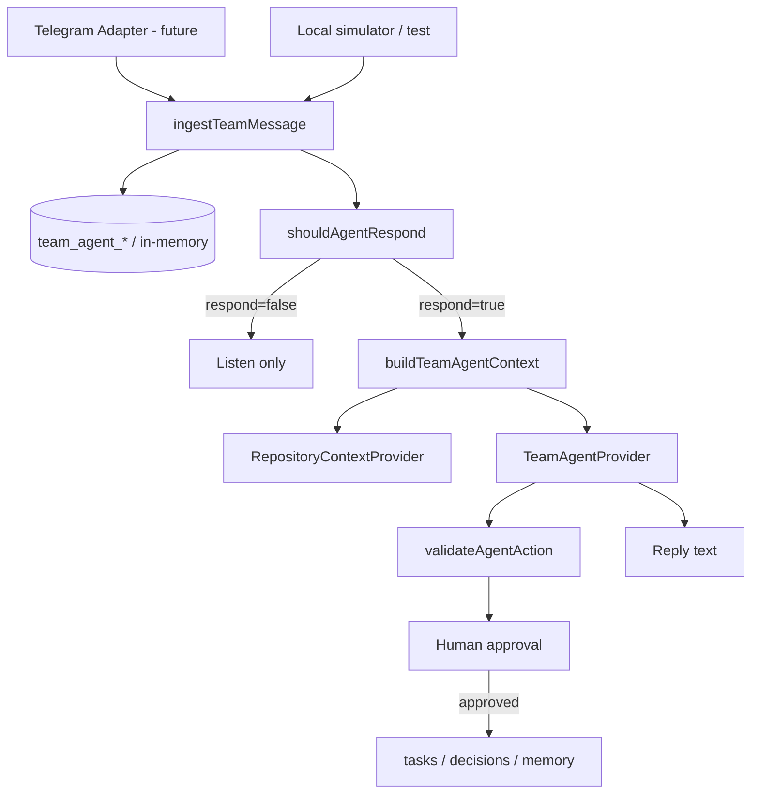

# Team Agent Architecture V1

**Audience:** developers of КРУГИ  
**Scope:** internal team coordination agent — **not** a product feature  
**Status:** Foundation V1 (no live Telegram bot, no production LLM)

---

## 1. Why it exists

The development team (3 people) needs a bot in a private Telegram group that:

- listens to all messages but does **not** interrupt normal chat;
- responds only on `@mention` / explicit command;
- keeps structured memory of decisions, tasks, and constraints;
- helps distribute work to reduce file/migration conflicts;
- later links PLAN → TASK → ASSIGNEE → BRANCH → COMMITS → RESULT.

This is an **internal tooling** boundary. It must not become community chat, product messaging, or marketplace messaging.

---

## 2. Boundary

| In scope | Out of scope (V1 and generally) |
|---|---|
| `team_agent_*` tables | Product `messages` / reviews chat |
| `lib/team-agent/` | Public profiles, listings, jobs, events |
| Future private Telegram group bot | User-facing Telegram product channels |
| Mock / future LLM provider | Auto merge / deploy / `db push` |
| Local simulator + tests | Arbitrary shell from chat text |

**Naming:** `team_agent_*` prefix — deliberately separate from product entities.

---

## 3. Architecture diagram



---

## 4. Data model

Tables (migration `20260917160000_team_agent_foundation_v1.sql`):

- `team_agent_members`
- `team_agent_conversations` (`source_type`: telegram | manual | test)
- `team_agent_messages` (unique on conversation + external_message_id)
- `team_agent_decisions` (proposed → confirmed | rejected | superseded | cancelled)
- `team_agent_tasks` (`scope_paths text[]` for conflict detection)
- `team_agent_git_activity` (future GitHub events)
- `team_agent_memory` (controlled long-term facts)
- `team_agent_approvals` (human gate)

V1 runtime for tests/simulator: `InMemoryTeamAgentStore` (same semantics, no remote apply required).

---

## 5. Message lifecycle

1. Adapter / simulator calls `ingestTeamMessage` (source-agnostic).
2. Find/create conversation by `(source_type, external_conversation_id)`.
3. Resolve member by `telegram_user_id` (primary) or username (secondary).
4. Unknown sender → message stored, `member_id` null, flagged in metadata.
5. Duplicate external id → return existing row (idempotent).
6. `shouldAgentRespond` → usually false.
7. If true → context → provider → validate actions → optional approval → reply.

---

## 6. Memory model

See [`TEAM_AGENT_MEMORY_POLICY_V1.md`](./TEAM_AGENT_MEMORY_POLICY_V1.md).

**CHAT HISTORY ≠ MEMORY ≠ DECISION ≠ TASK.**

---

## 7. Task lifecycle

```text
proposed → approved → in_progress → review → completed
                ↘ blocked ↗         ↗
Any non-terminal → cancelled
(in_progress may also complete directly)
```

Invalid example: `completed → in_progress` (rejected by `canTransitionTask`).

Assignments proposed by the agent stay in `team_agent_approvals` until a human approves.

---

## 8. Decision lifecycle

```text
proposed → confirmed (authoritative)
        → rejected
confirmed → superseded (via new decision with supersedes_decision_id)
```

Only `confirmed` decisions enter authoritative context.

---

## 9. Security model

- RLS enabled + **FORCE** on all `team_agent_*` tables.
- **No policies** for `anon` / `authenticated`.
- Table privileges **revoked** from `anon` / `authenticated`.
- Grants only to `service_role`.
- Future Telegram webhook / LLM keys: server-only env, never `NEXT_PUBLIC_*`.
- No service_role in client bundles.
- No arbitrary shell from message text (repository provider uses fixed `git` argv only).

---

## 10. Repository integration

Interface: `RepositoryContextProvider`

| Implementation | V1 |
|---|---|
| `MockRepositoryContextProvider` | yes |
| `LocalRepositoryContextProvider` | yes (allowlisted git argv) |
| `GitHubRepositoryContextProvider` | stub / next step |

See [`GITHUB_INTEGRATION_V1.md`](./GITHUB_INTEGRATION_V1.md).

---

## 11. Telegram integration

Contract only — **not connected** in this foundation.

See [`TELEGRAM_ADAPTER_V1.md`](./TELEGRAM_ADAPTER_V1.md).

---

## 12. GitHub integration

Contract only — no webhooks in V1.

---

## 13. Human approval boundary

Agent may **propose**:

- task assignments / batches
- decisions / memory writes (decisions stay `proposed` until confirm)

Agent must **not** silently finalize ownership. `approvePendingAssignment` applies after explicit approval.

---

## 14. Implemented now

- SQL migration (additive, not applied to remote by this task)
- `lib/team-agent/` domain layer
- Ingestion, response policy, context builder
- Task / decision / memory / conflict / distribution engines
- Action allowlist + mock provider
- Local simulator + deterministic tests
- Docs + navigation registration + `.env.example` placeholders

---

## 15. Intentionally NOT implemented

- Production LLM provider wiring
- GitHub webhooks / auto PR analysis
- Auto merge / deploy / remote `supabase db push`
- Durable Supabase persistence for Team Agent runtime (migration exists; in-memory used until applied + wired)
- Vector database
- LangChain / LlamaIndex
- Product UI for Team Agent

Telegram Bot API adapter + local long-poll + webhook route **are** implemented — see [`TELEGRAM_ADAPTER_V1.md`](./TELEGRAM_ADAPTER_V1.md).

---

## 16. Next step

1. Put bot token / chat id into `.env.local` (never commit).
2. Run local poller: `npx tsx lib/team-agent/telegram/poll.ts`.
3. When ready: apply migration + wire service_role persistence; optional production webhook + real LLM provider.

---

## Primary code

- [`lib/team-agent/`](../../lib/team-agent/)
- Migration: [`supabase/migrations/20260917160000_team_agent_foundation_v1.sql`](../../supabase/migrations/20260917160000_team_agent_foundation_v1.sql)
- Simulator: `npx tsx lib/team-agent/simulate.ts`
- Tests: `npx tsx lib/team-agent/team-agent.test.ts`
